# Advanced MySQL and MariaDB

https://www.linkedin.com/learning/advanced-mysql-and-mariadb/welcome?u=26110466

Environment

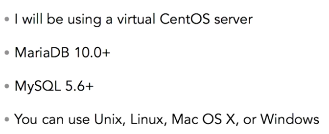

## How MariaDB is Different

- Overview

  - Is a fork of MySQL
  - Based on MySQL 5.1
  - Added XtraDB, PBXT, FederatedX storage engines
  - Added Aria storage engine
  - Newer version after MariaDB v5.x is v10.0
    - GTID
    - Multisource replication
    - Cassandra storage engine
    - CONNECT storage engine

- Exploring server thread pooling

  - Thread Pooling
    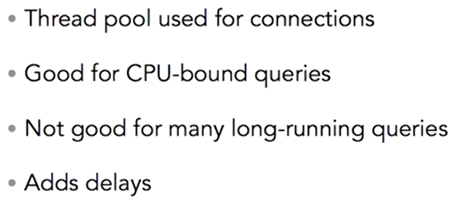
    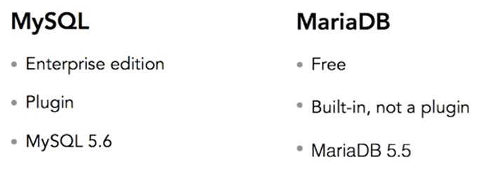
  - Thread Pool Size
    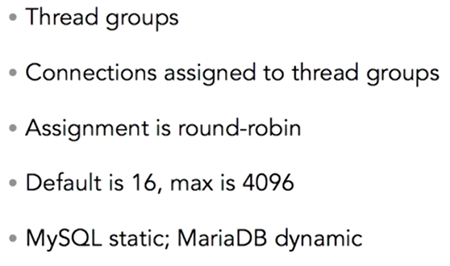
  - Viewing user statistics
    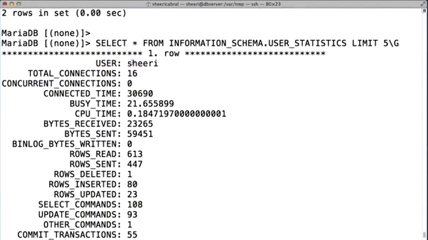
    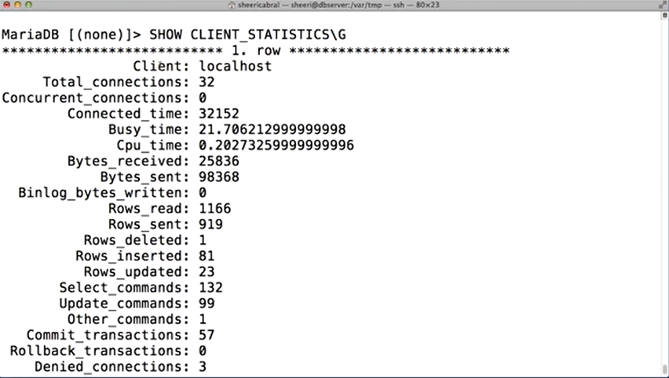
  - Creating and using virtual columns
    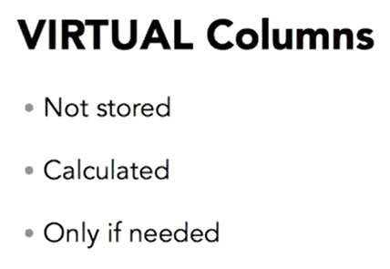
    - Example:
      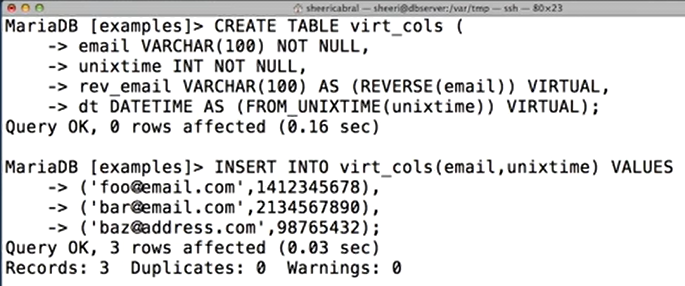
      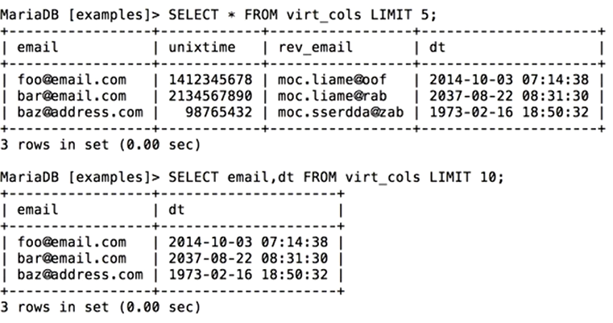

  - Using persistent virtual columns

    - it's opposite of virtual

      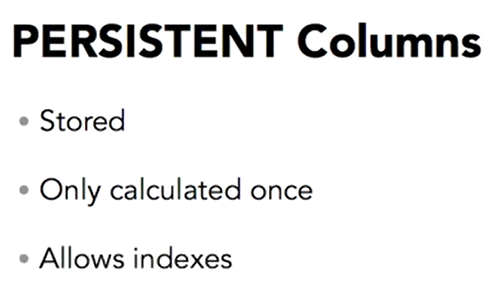

    - Virtual column limitations
      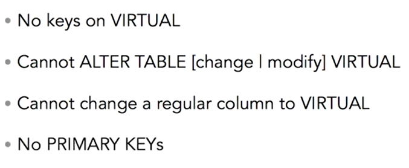

    - Example:
      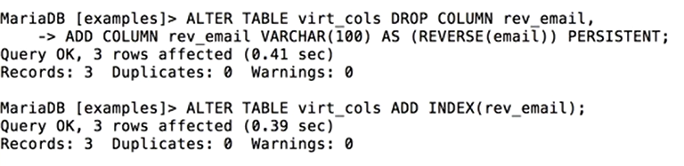
      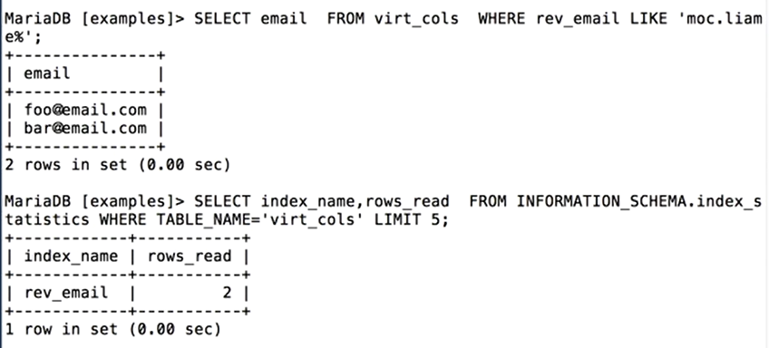

  - Progress reporting and millisecond resolution
    - Aria Progress Reporting
      - Check Table, Repair Table, Analyze Table, Optimize Table

## The Sphinx Storage Engine

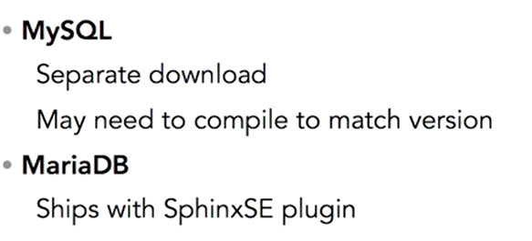

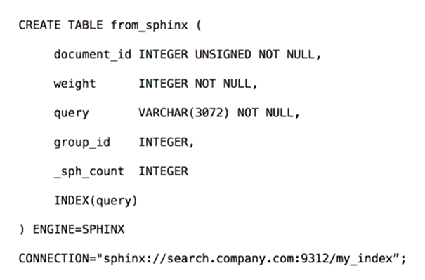

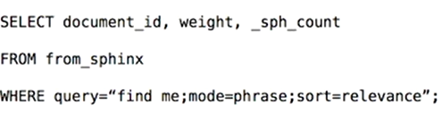

## NoSQL Integration

Install handler socket

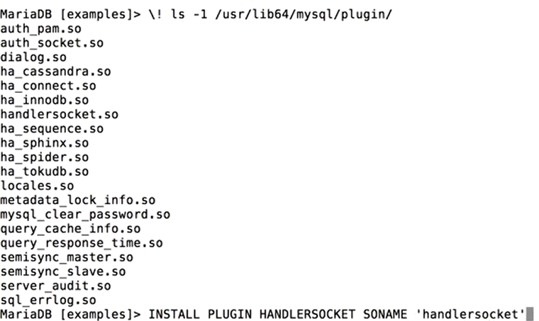

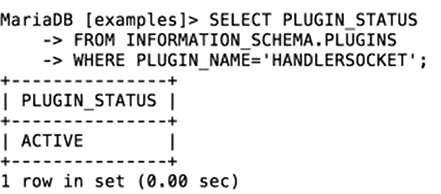

Configuring HandlerSocket

sudo vi /etc/my.cnf

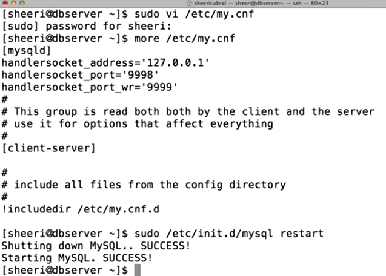

HandlerSocket Client Libraries:

Ruby, JavaScript, Scala, Haskell

Handler Socket Authentication:

Plain text. handlersocket_plain_secret, handlersocket_plain_secret_wr

Handler Socket Threads:

handlersocket_threads, handlersocket_threads_wr

Other Variables:

Timeouts, Logging Verbosity, Advanced Features, Knowledgebase at mariadb.org

## Global Transaction Identifiers and Multisource Replication

Benefit of GTIDs:

- Easily CHANGE MASTER
- Just change host and port
- Failover easier

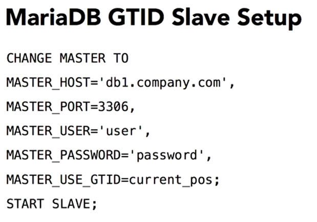

## Conclusion

- Advanced Features
  - Sphinx
  - Audit plugin
  - Authentication plugin
  - Server thread pooling (optimize db connection)
- Difference with mySQL:
  - Virtual Columns
  - Progress Reporting
  - Subsecond time resolution
  - Additional user statistics

