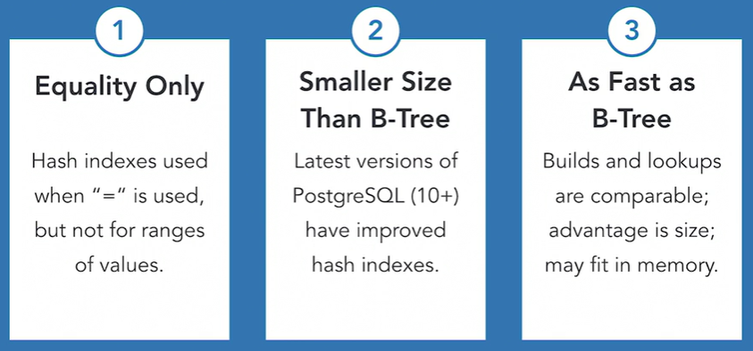

# Become SQL Developer

## Part 1 - Programming Foundation: Database

https://www.linkedin.com/learning/programming-foundations-databases-2/

### SQL

- The language that we used to communicate with database

### Schema

- The database's **schema** includes the information about the layout of tables and other information about the database itself. 

### Database Foundations

- ACID and transactions
  - Atomic
    - Atomicity means that the transaction behaves as one single action.        
  - Consistent
  - Isolated
    - The "isolated" requirement actually refers to the data that is altered by other actions.          
  - Durable
    - Durability requires that data changed by the transaction is written to the database.        
- CRUD
  - Create - Read - Update - Delete
- Transactions
  - All of the steps for an action must be completed
- **Unique values, only occurs once in given column**
- SELECT * FROM table_name
  - has 2 clauses, **select** and **from**
- Relationship
  - a set of attributes (columns) that describe information about specific instances (rows) of an entity
  - Example: a customer with their favorite table in the restaurant
    - This would be a one-to-many relationship. For every one table, there could be many customers who prefer to sit at it. But one customer cannot have many favorite tables.        
- A **composite key** combines two or more fields to act as a unique identifier.
  - When a primary key does not exist, a composite key can be used to uniquely identify and relate a record to other data.        

### Tables

- Prepare the schema
  - Using an ER diagram, you can plan out what fields will appear on which tables, and how they're related.
- Naming tables
  - should be pluralized
- Columns and data types
- Number and other types
  - Storing numeric data in numeric data types gives you the  ability to work with numbers directly, as you might do when you use  mathematical operations in queries.        
- Primary and foreign keys

### Database Optimization
- 1NF (First Normal Form)
   - Values in each cell should be atomic and tables should have no repeating groups
- 2NF
   - No value in a table should depend on only part of a key that can be used to uniquely identify a row
- 3NF
   - Values should not be stored if they can be calculated from another non-key field
- Denormalization
   - The process of intentionally duplicating information in a table, in violation of normalization rules
   - Used to denormalize the normalized database

### Relationships

- Three types of relationship
  - One to Many
    - Example: one customer can have many reservations in booking system
  - Many to Many
    - Example: In restaurant, many orders can have many dishes, many dishes can be in many orders
    - Extra table needed: OrderDishes (OrderID, DishID)
  - One to One
    - Example: customers -> personalInfos
- Value from one field in one table, must be exist in the other field in another table
  - example: FavoriteDish from customer table, and DishID from Dishes table


## Part 2 - SQL Essential Training

https://www.linkedin.com/learning/sql-essential-training-3


- add one day to the current day

  ```sql
  SELECT DATETIME('now', '+1 day');
  ```

- Triggers

  - Useful to create timestamps
  - why?
    - to automatically execute a group of statements whenever a specified event occurs
  - AFTER INSERT
    - Trigger timestamp right after inserting value
  - BEFORE UPDATE
    - The type of trigger to use for preventing updates to reconciled rows

- Views and Subselects

  - View as saving query
    - A VIEW is like a stored subselect.
  - It's equivalent to `WITH` in Oracle SQL
  - When should you create a view from a SELECT statement?
    - when you want to modify the existing displayed data
  - What is a complex view?
    - Complex views are created from more than one table or joined queries.

- Simple CRUD Application

  - Why is it preferable to use a named global space than the default global space for variables?
    - to avoid collisions and clutter
  - CRUD = Create Read Update Delete


## Part 3 - SQL: Data Reporting and Analysis

- Make your queries faster
  - using ROWNUM
    example: `where rownum <= 25`
  - it's similar to `limit` in PostgreSQL
  
- Saving query using `VIEW`

  - it's similar to `WITH` clause in Oracle

- Use variables using `INTO`

  - Example: `SELECT col_name INTO <var_name>`

- Use *Functions*
  

  

- Use *Procedures*

  
  


# Advanced SQL for Query Tuning and Performance Optimization

https://www.linkedin.com/learning/advanced-sql-for-query-tuning-and-performance-optimization

## Partitioning Data

- Large Tables = Large Indexes
- Indexing helping scanning performance
  - If we know certain data that we need exist in one of the partition, we can use only that partition
  - For example: partition based on monthly data


## Types of Indexes

- Indexing
  - purposes
    - speed up access to data
    - help enforce constraints
    - indexes are ordered
    - typically smaller than tables
  - Reading speed - from memory is the fastest
    
- B-tree indexes
  - Uses
    
  - Example use in Postgres
    
- Bitmap
  - Use cases
    
  - Oracle allow you to create bitmap indexes explicitly
  - Postgres does not, but builds bitmap indexes on the fly as needed
- Hash
  - Few things
    
- Special purpose indexes on Postgres
  - GIST
    
  - SP-GIST
    
  - GIN
    
  - BRIN
    


## Tuning Joins

- Tips
  
- Subqueries vs Joins
  - There is performance difference between using subqueries and joins
    


## Partitioning Data

- Horizontal vs vertical partitioning
  - Horizontal
    
  - Vertical
    
- Range
- List
- Hash


## Materialized Views

- Precomputed queries
- Join and store results
- Apply other operations
- Info
  
- Example:
  
- When to Use
  


## Other Optimization Techniques

- Collect statistics about data in tables
- Hints to the query optimizer
- Parallel query execution
- Misc tips
  - Indexing
    
  - Index Range Scan
    
  - Filtering and Data Types
    


# Datacamp - Cleaning Data in SQL Server Databases

https://campus.datacamp.com/courses/cleaning-data-in-sql-server-databases/


## Starting with Cleaning Data

- Using Replicate function to format data
  

  


## Dealing with missing data, duplicate data, and different date formats

- Filter missing value using COALESCE()
  

- Dealing with different date formats

  - using CONVERT
    
  - using FORMAT
    
  - Convert vs Format
    `FORMAT()` is more flexible, but it is not recommended for high volumes of data because it is slower.

  

## Dealing with out of range values, different data types, and pattern matching

- What is out of range values?
  
  - Detecting out of range values
    
- Converting data with different types
  
- Pattern matching
  
  


## Combining, splitting, and transforming data

- Combining name and surname
  

- Combining Dates
  

- Splitting data of one column into more columns
  

  

- Transforming rows into columns and vice versa
  - Using PIVOT
    
  - Using UNPIVOT - turn product_name into rows
    

## Summary

- Chapter 1
  
- Chapter 2
  
- Chapter 3
  
- Chapter 4
  