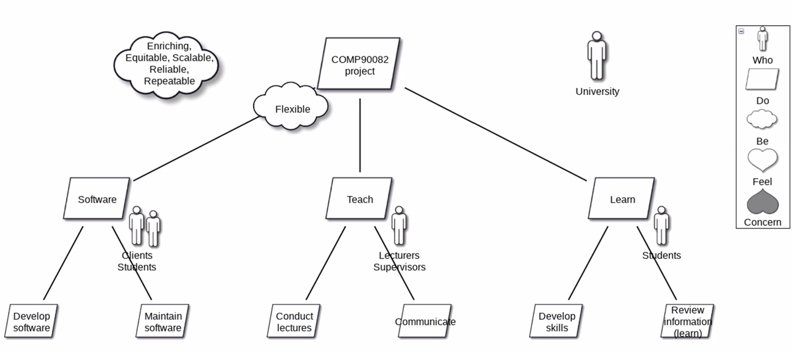

## Co-Design with do-be-feel™ Workshops with Kuldar Taveter & Tahira Iqbal

By: UT Delta Sandbox Toolbox

Cover

This time we'll focus on the DO-BE-FEEL method and co-design.

Kuldar Taveter and Tahira Iqbal will guide you through one of the steps in the designing process - designing with users. As the workshop uses self-driving cars as an example, the purpose is to elicit functional, quality and emotional user needs for self-driving cars.

The needs are elicited as the lists of functional, quality and emotional goals. Emotional goals are different from functional goals, which address the functional intent of users, and from quality goals, which detail the qualities of functional goals (e.g. “easy to use”). Emotional goals address how the user feels about a system to be designed based on their life experience and values.

This is the final topic for the Toolbox season. The next event will be announced at the end of summer!

## Presentation by Kuldar Taveter

## 

- Collaboration with partner from Swinburne University of Technology in Melbourne, Australia

### Overview

## Developing Motivational Models - Three Stage Process

### DO/BE/FEEL/WHO Method

### Seven Step Process from Lists to Model

## Cluster elements

## Review lists - add elements

- Feel = human emotions

## Build do Hierarchy

### Add Roles

### Add be-goals

### Self-driving correlation

## Presentation by Tahira

Practice

## Expected Output

## Photos

