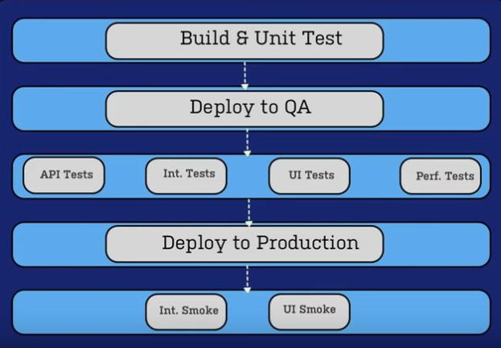

https://youtu.be/lg9f52SmFyw

# What is Bamboo?

- CI, build, and deployment server for software dev
- web-based app
- java-based
- platform independent
- support integration and testing of all programming languages

# CI/CD - Pipeline

## Continuous Integration

Build - Test - Merge

## Continuous Delivery

Automatically release to repository

## Continuous Deployment

Automatically deploy to production

# Functionality

- Schedules and coordinates all work - like Apache Airflow or Kubernetes for database development
- Source repository
- Build is triggered
- Artifacts (executable application)
- Configurable front-end

# Compatibility with other products

- full integration with Atlassian suite
- individualisation and optimization through plugins and addons
- supports various build tools, version management systems, and test frameworks

# Tasks

- building
- testing
- packaging
- deploying

## Script Task

- allows us to run a bat file or some other executables within the context of our project
- Example:
  - need to fill in description: "Run build.bat"
  - set script location: "file"
  - in script file you specify the file which should be executed: 'build.bat'
  - last step is to specify an work subdirectory: (path of the file) for example: "Project_dir\Bamboo-test"
  - save task

## Command Task

- to execute globally defined command
- Example:
  - Task description: "Zip the presentation folder"
  - 7-Zip is configured on our Bamboo server
  - Argument (what folder we want to zip):
    "a -tzip build.zip Project_dir'\Bamboo-test\presentation"
  - save task

# Purpose and advantages

- automation
- QA
- integration of software
- CI, CD
- version management
- parallelism
- optimisation and acceleration of the software dev process

# Bamboo Atlassian Tutorial

https://www.youtube.com/playlist?list=PLaD4FvsFdarQp-qHSr3EqWz1WLFa-HUeD

## Continuous Delivery in Action

- Each job in bamboo can contain multiple tasks and stages

## Build Structure Deep-Dive

### Building Blocks

- Plan
  - Multiple stages
    - Multiple jobs
      - Multiple tasks

### Tasks: discrete build steps

- Executed one at a time, run sequentially inside their container
- Checkout from source control
  - Git, Hg, SVN, P4, CVS
- Build Engine
  - Ant, Maven, MSBuilder, Rake, Grails
- Analysis and Reporting
  - Code Coverage, Static Analysis, Performance
- Deployment
  - Tomcat, Heroku, JBoss, LiveRebel, **Artifactory**. DeployIt, SCP

### Jobs: collections of related build steps

- Group dependent tasks together inside a job to ensure order of execution
- Place independent tasks in separate jobs to parallelize build steps and tighten the feedback loop

### Stages: control the flow of *Job* execution

- Jobs within a Stage run in parallel if enough build agents are available
- All Jobs in the current Stage must complete successfully before moving to the next Stage

Plans: one container to rule them all

- Plans represent an atomic series of build steps
- A variety of triggers can initiate the build of a Plan
  - Change in SCM
  - Cron/Timer
  - Manual (push-button)
  - Parent Plans

## Moneypenny Speaks! Getting the Most From (Bamboo) Agents - Atlassian Summit 2012

https://youtu.be/Twyopzj9O6A?list=PLaD4FvsFdarQp-qHSr3EqWz1WLFa-HUeD

- Maximizing the productivity
- Your Mission:
  - Build report reconnoaissance
  - Eradicate re-compiles
  - Install the HungBuildKiller plugin

