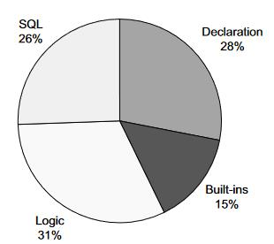
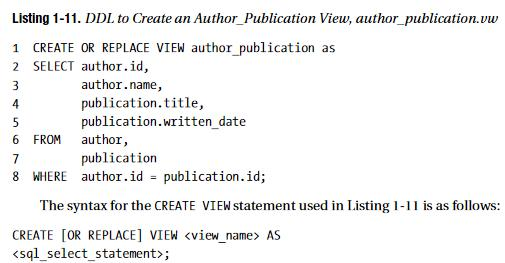
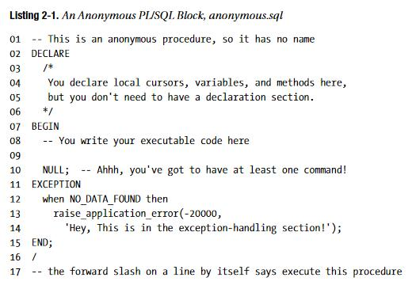
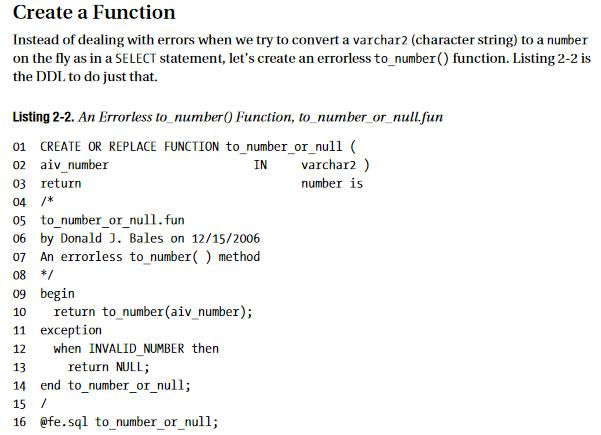
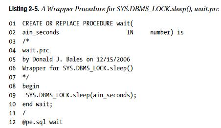
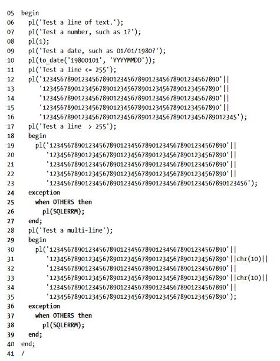
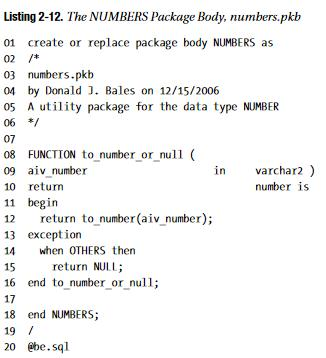
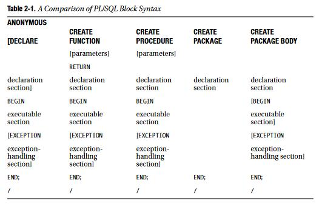

# Beginning PL/SQL: From Novice to Professional by Donald Bales

https://www.goodreads.com/book/show/2092455.Beginning_Pl_SQL


## Genesis

- What is a PL/SQL stored procedure composed of?
  
- Using Views
  


## PL/SQL Is Square, Man!

- It's 3-dimensional
- Has 4 keywords:
  - DECLARE
  - BEGIN
  - EXCEPTION
  - END
- Anonymous Blocks
  
- Create a Function
- Procedures
  
- Nested Blocks
  
- Packages
  
- Summary
  


## Now Where Did I Put That?

- Variable declaration

  ```sql
  DECLARE
  	n_id			number;
  	v_name			varchar2(100);
  	d_birth_date	date;
  	v_gender		varchar2(30);
  	
  BEGIN
  ...
  END;
  ```

  - Variable anchor, using table `AUTHOR`

    ```sql
    	n_id			AUTHOR.id%TYPE;
    	v_name			AUTHOR.name%TYPE;
    	d_birth_date	AUTHOR.birth%TYPE;
    	v_gender		AUTHOR.gender%TYPE;
    ```

  - Variable assignments

    ```sql
    DECLARE
    ...
    BEGIN
    	n_id			:= 400;
    	v_name			:= 'Enlik Tjioe';
    	d_birth_date	:= to_date("19991010", 'YYYYMMDD');
    	v_gender		:= 'M';
    END;
    ```

    

- Scope

- Parameters


## Whoa! One Statement at a Time, Please!

- Insert
- Update


## Next Please, One Row at a Time!

- Cursors
  - `CURSOR` allow you to `FETCH` multiple rows from a `SQL SELECT` statement
  - Fetch manually or automatically using a `CURSOR FOR LOOP`
- Bulk Collect
  - Used to improve the efficiency of loading an array with values from the database, and you can use `FORALL` to improve the efficiency of executing SQL statements with values from an array.


## Just Like It Is in the Real World!

- "Those who cannot remember the past are condemned to repeat it.” - George Santayana, Philosopher
- "You can only connecting the dots by looking at the past, not the future" - Steve Jobs
- 

