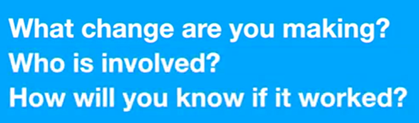

# Creativity at Work by Seth Godin

https://www.linkedin.com/learning/creativity-at-work-a-short-course-from-seth-godin/what-is-creativity-anyway?u=26110466

You *are* a creative person. Despite what your inner critic may have told you, you absolutely can solve complex business problems without a roadmap. The potential is there; whether or not you tap into it is up to you. In this concise course, Seth Godin—the author of 20 best-selling books, including *The Dip*, *Linchpin*, *Purple Cow*, and *The Practice*—lays out how to help your team let go of the fears that hinder your creative progress and start creating work that matters. Learn how to combat preconceived notions about creativity, including the idea that creativity is a gift bestowed upon a select few. (Spoiler alert: it's not.) Discover how to tap into your team’s creativity by embracing the possibility of failure, cultivating practical empathy, and exploring the root causes of writer's block and impostor syndrome. Plus, get tips for making creative problem-solving a habit that sticks.

## What is Creativity anyway?

- Being creative: you're willing to solve interesting problem for other people

## Why is so difficult at work?

- Distractions aren't distractions, they are the opportunities
- People like being good at their jobs

## Barriers that lie between you and value creation

- Questions:
  

## Bringing outside voices inside

- A problem without a solution is a situation, not a problem
  - gravity is a situation, we can't solve that
  - the traffic jam that happened every day is a situation
- Hear directly from your customer outside who experienced that situation
- Make the problem visible, bring the voices inside
- Your job is to say this "Let's agree that there is a problem here"

## Developing practical empathy

- Willingness to acknowledge that other people not see what you've seen.

## The difference between management and leadership

- There's a difference between responsibility and authority
  - everyone can take responsibility
- To identify the problem that you try to solve

## Revolutions destroy the perfect before enabling the impossible

- We're living in impossible world, always changing world

## The commitment to failure

- On your way to become better
- Nobody want to say, I'm in the business to failing
- Willing to be wrong and wrong and wrong, and then to be right
- Let's try something that might not work

## There's no such things as writer's block

- WB is a myth
  - I don't have any idea -> myth
- "I simply type" from 6.30am until noon
  - I doesn't matter if it's good
- Sooner or later you'll cope with it
- Do bad writing!
- Everyone has to contribute bad idea
- 5-10, say the worst idea
- Pictionary game
  - it's like guessing something from someone who drawing
- What if, what if, you get the idea

## Learning how to juggle

- Important point of juggle is to not drop the ball
- 20 mins right to left, 20 mins left to right, 20 mins combination
  - Be good at throwing is the secret of juggling
  - The catches will take care of themselves
- Before catching, you need learn how to throwing

## Impostor syndrome is real

- We can't fight this, you're an impostor
- If you try to solve problem that never been to be solved, how can you prove you have the right answer?
- You can't be creative when you can't feeling as impostor

## Who becomes your competition?

-  If you are not frozen, you need right at the people who are about to become your competition, and say "Bring them on!" Because the problem is worth enough to be solved with creative way

## And then doing it all again

- Develop a practice, we do this work regardless the outcome
- Do works matter for people who care

## BONUS: ShipIt Journal

- From exercise files