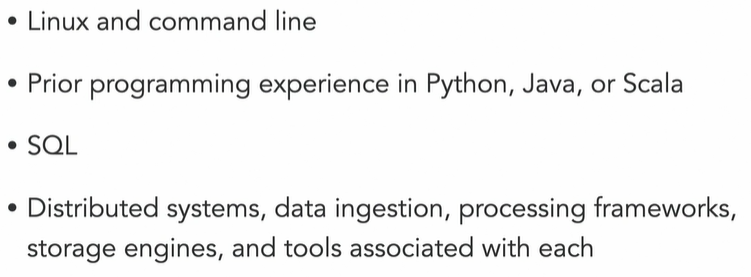
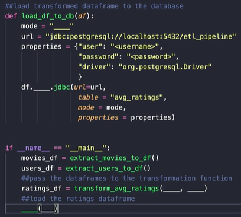

## Data Engineering Foundations

https://www.linkedin.com/learning/data-engineering-foundations

Instructor: Harshit Tyagi

## Intro

- Challenges in Data-driven Organization
  
- Roles:
  
- Skills needed:
  
- Data Engineer vs Data Scientist
  
- Essential tools
  - Processing Frameworks
    - Data cleaning - aggregation - clustering - batch/stream processing
    - Tools: Spark - Hive - Kafka
  - Automation: Scheduling
    - Set up and manage workflows
    - Plan jobs with specific interval
    - Resolve dependency requirement of jobs
    - Tools: Airflow, Oozie, Luigi
  - A complete pipeline
    

## DB and Dataframes

- Type of data
  
- SQL vs NoSQL
  
- DB Schema
  - Schema describes the structure and relations of DB
    
  - Creating Schema
    
  - SQL: Star Schema
    - Consist of one or more fact tables referencing any number of dimension tables
      
- Distributive Computing
  - How it works
    
  - Benefits
    - More processing power
    - More scalable
    - Cost effective
    - Fault tolerance
  - Risks
    
  - Multiprocessing using Python
    
  - Using Dask
    

## Data Engineering Tools

- MapReduce and Hadoop
  

  

- Hadoop DFS
  

- Hadoop MapReduce
  

- Hive

  - Hive SQL, originally developed by Facebook, now maintained by Apache
    
  - How Hive works?
    

- Spark

  - Info
    
  - RDD
    
    
  - PySpark
    
    

- Airflow

  - Workflow
    
    - the reason why we need automation is to be able work for it while we on holiday (weekend / public holiday)
    - cron can do this, but only in Linux
  - DAG (Directed Acyclic Graph)
    
  - Scheduler Tools
    - Cron jobs
    - Spotify's Luigi
    - Apache Airflow
  - Airflow DAG example
    
  - Coding DAGs
    
  - 

## ETL Pipelines

- Extracting Data (E)

  - Sources
    - Most famout format: JSON
    - Data through APIs
      
    - Data from Databases
      
  - Extract from PostgreSQL DB
    - Using PySpark
      
      
  - Challenge: Data Extraction
    
    - driver = org.postgresql.Driver

- Transforming Data (T)

  - Example
    
    
  - Challenge: Transforming data
    
    - users_df.groupby('movie_id').mean('rating')
    - movies_df.id == avg_rating.movie_id
    - print(df.show())
       

- Loading Data into DB (L)

  - Example
    
    

  - Challenge

    

    - mode = "overwrite"
    - ratings_df = transform_avg_ratings(movies_df, users_df)
    - load_df_to_db(ratings_df)

- Scheduling ETL pipeline using Airflow

  - Setup
    

    

  - Transformation function (no processing happening here, it's all about configuration)
    

    

  -  Folder structure
    

  - Start server --> airflow webserver (get the URL)
     

    

    

