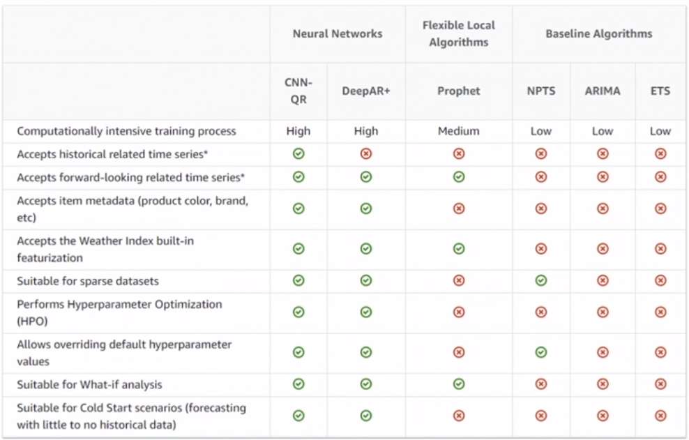
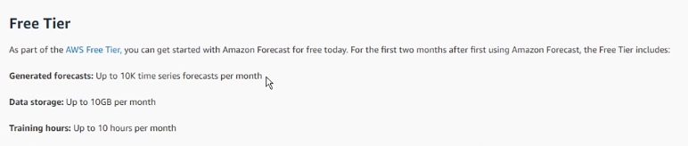
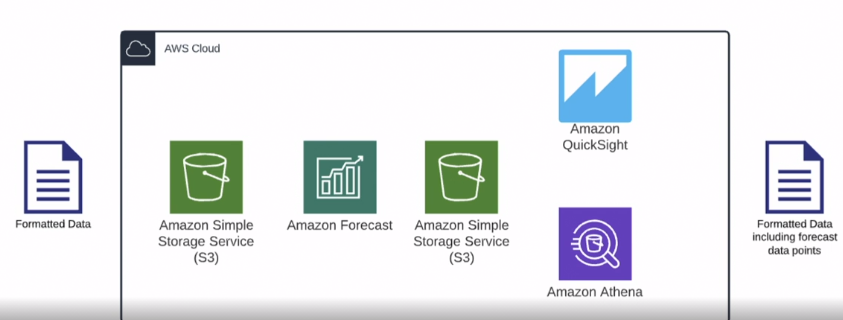
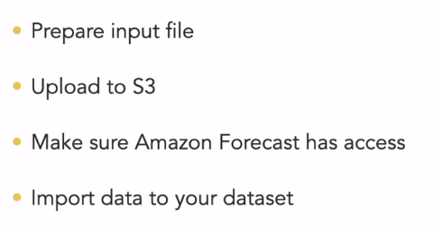
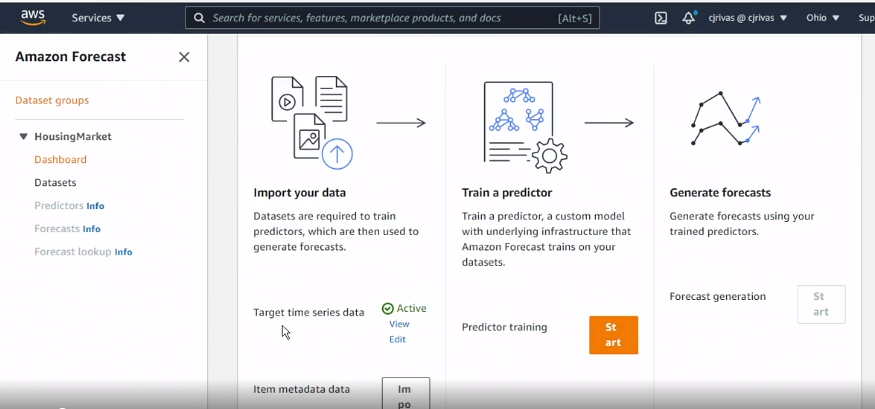
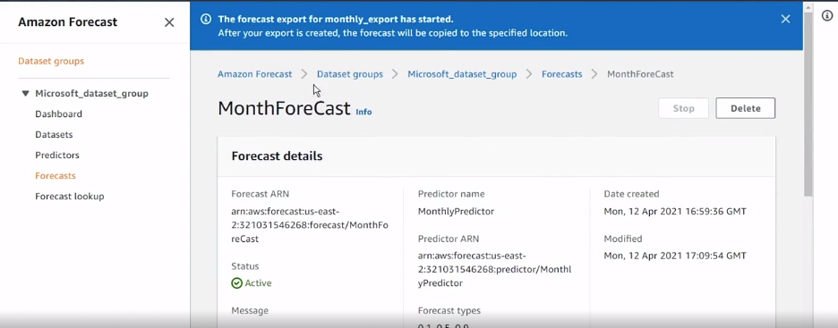
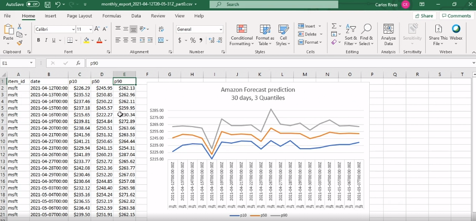

# Data Prediction with Amazon Forecast

https://www.linkedin.com/learning/data-prediction-with-amazon-forecast/

by Carlos Rivas, AWS Infrastructure Expert

## Concepts

- Datasets and Groups
  - time series data
  - predefined dataset
    - check on Kaggle, weather, stock, etc
- Predictors
  - Forecasting model that has been trained
- Algorithms
  
- Amazon Forecast pricing
  - Free tier
    

## Data and Training

- Workflow
  
  - Input
    
  - Process
    - Train your predictors
    - Evaluate
    - Generate forecast
  - Output
    - Export forecasts
    - Save to S3
    - Post-process using Athena, QuickSight
    - Use your forecasted data points in your apps
- Data preparation and ingestion
- Predictor training
  

## Predictions and Visualization

- Exporting your forecast
  
- Forecast visuals
  
  - p10 = low; p50 = medium; p90 = high
- Should you trade stocks using Amazon Forecast?
  - No
  - it will use the past to predict the future
  - for long-term, stock price was affected by
    - political news
    - economic news
    - global factors
  - for short-term
    - volatility
    - speculative risk
    - transaction costs

## Conclusion

- Summarize in one word: Practice!
- Consider Amazon QuickSight
  - visualization and BI tools that helps you make correlation of data, charts, and many visualization tool (like Tableau)
- Automate
  - using Python or R, to build automation process
- Resources
  - Kaggle
  - Documentation
- Data Science is about enjoying what you do

