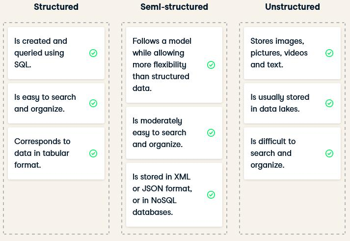
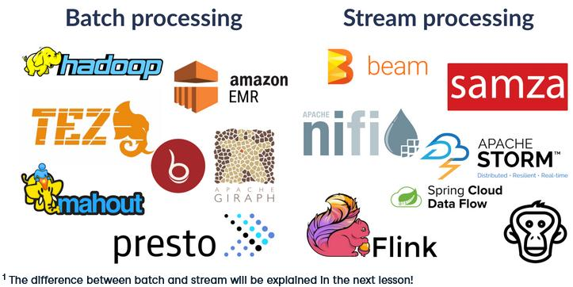
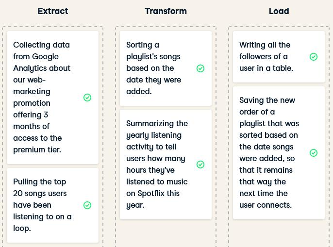
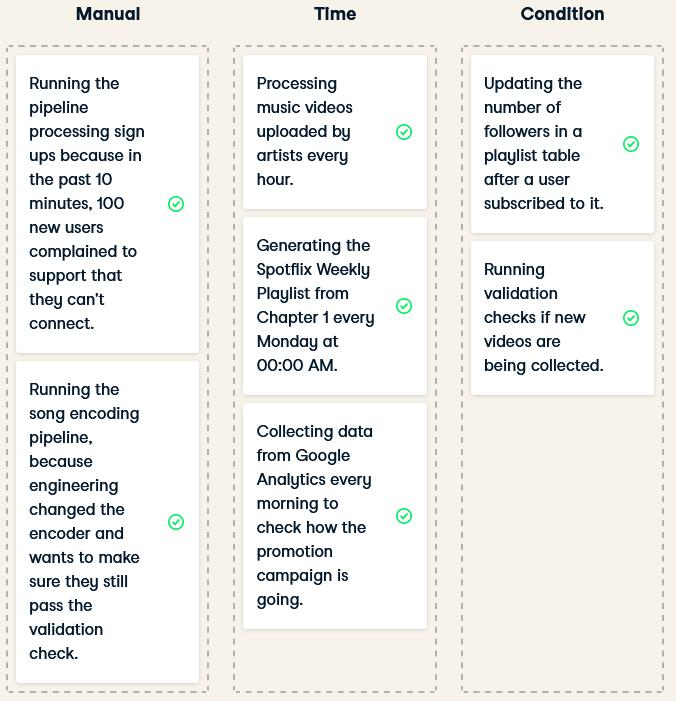
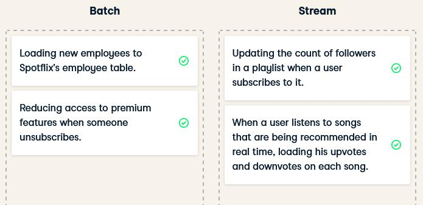
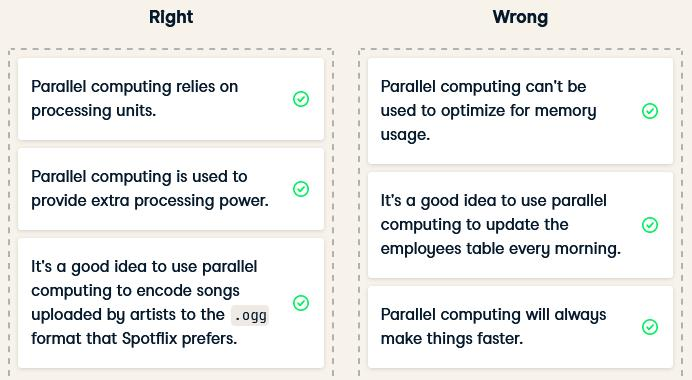
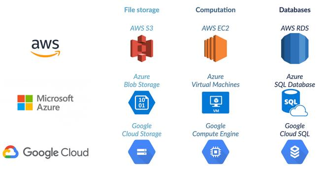

# Data Engineering for Everyone

https://campus.datacamp.com/courses/data-engineering-for-everyone/

## Storing Data

- Data Structures
  

- SQL databases

  - SQLite, MySQL, PostgreSQL, Oracle SQL, SQL Server
    - they are a bit different but pretty similar
    - it's like switching from British English to American English
  - SQL = industry standard

- Data Lakes and Data Warehouses

  | Data Lake                           | Data Warehouse                                  |
  | :---------------------------------- | :---------------------------------------------- |
  | Store all the raw data              | Specific data for specific use                  |
  | Can be petabytes (1 million GBs)    | Relatively small                                |
  | Stores all data structures          | Stores mainly structured data                   |
  | Cost-effective                      | More costly to update                           |
  | Difficult to analyze                | Optimized for data analysis                     |
  | Requires an up-to-date data catalog | Also used by data analyst and business analysts |
  | Used by data scientist              | Ad-hoc, read-only queries                       |
  | Big data, real-time analytics       |                                                 |

  - Data catalog for data lakes
    - What is the source of this data?
    - Where is this data used?
    - Who is the owner of the data?
    - How often is this data updated?
    - Good practice in terms of data governance
    - Ensure reproducibility
    - No catalog --> data swamp
    - Good practice for any data storage solution
      - reliability
      - autonomy
      - scalability
      - speed
  - Database vs data warehouse
    - Database:
      - general term
      - loosely defined as organized data stored and accessed on a computer
    - Data warehouse is a type of database

## Moving and Processing Data

- Data processing = converting raw data into meaningful information

- Values

  - Remove unwanted data
  - Optimize memory, process, and network costs
  - Convert data from one type to another
    - convert songs from .flac to .ogg
  - Organize data
    - reorganize data from data lake to data warehouse
  - To fit into a schema/structure
  - Increase productivity

- How data engineers process data

  - Data manipulation, cleaning, and tidying tasks
    - that can be automated
    - that will always need to be done
  - Store data in a sanely structured database
  - Create views on top of the database tables
  - Optimizing the performance of the DB

- Framework for Batch Processing and Stream Processing
  

- ETL example

  

- Scheduling Data

  - Batches and streams
    - Batches
      - Group records at intervals
      - Often cheaper
    - Streams
      - Send individual record right away
  - Tool = Apache Airflow, Luigi

- Scheduling example
  

- batch_vs_stream
  
- Parallel Computing
  - Basis of modern data processing tools
  - Necessary:
    - Mainly because of memory
    - Also for processing power
  - How it works:
    - Split tasks up into several smaller subtasks
    - Distribute these subtasks over several computers
  - Benefits and risks
    - Employees = processing units
    - Advantages:
      - extra processing power
      - reduce memory footprint
    - Disadvantages:
      - Moving data incurs a cost
      - Communication time
  - right_and_wrong_about_parallel_computing
    
- Cloud Computing
  - Servers on premises
    - Bought
    - Need space
    - Electrical and maintenance cost
    - Enough power for peak moments
    - Processing power unused at quieter times
  - Cloud server
    - Rented
    - Don't need space
    - Use just the resources we need
    - When we need them
    - The closer to the user the better
  - Reason to use cloud
    - Database reliability: data replication
    - Risk with sensitive data
    - 3 Big Providers
      
  - Multi-cloud
    - Pros
      - Reducing reliance on a single vendor
      - Cost-efficiencies
      - Local laws requiring certain data to be physical present within the country
      - Militating against disasters
    - Cons
      - Cloud providers try to lock in consumers
      - Incompatibility
      - Security and governance
  - 

