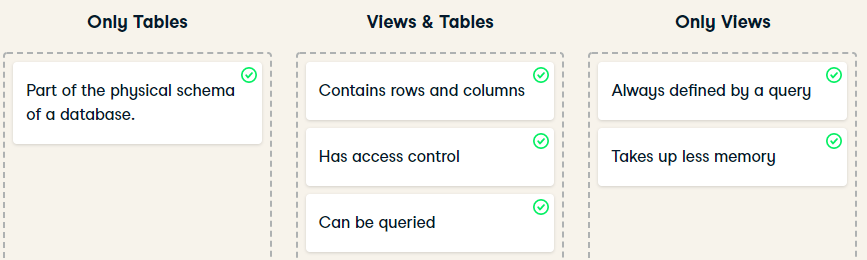

# Datacamp - Database Design

https://campus.datacamp.com/courses/database-design


## Processing, Storing, and Organizing Data

### OLTP and OLAP

- It works together
  
- OLTP vs OLAP
  
- Takeaways
  - Step back and figure out business requirements
  - Difference between OLAP and OLTP
- Quiz
  


### Storing Data

- Data Structure
  

  

- Storing data beyond traditional databases
  

- Data warehouses
  

  - Why choose Data Warehouse over Data Lakes?

    Analysts will appreciate working in a data warehouse more because of its organization of structured data that make analysis easier.

- Data lakes
  

- ETL and ELT
  

- ETL example
  


### Database Design

- What is it?
  

- Data Modeling

  

- Conceptual, Logical and Physical
  

  


## Database Schemas and Normalization

### Star and Snowflake Schema

- Star schema
  

  

- Normalization
  


### Normalized and Denormalized Databases

- Star and snowflake schema
  

- Why normalization?

  - saves space
    

    

  - ensures better data integrity
    

- Pros and Cons of Normalization
  

- OLTP requires more normalization compare to OLAP
  


### Normal Forms

- Normal Forms
  

- 1NF rules
  

- 1NF form
  

- 2NF
  

- 3NF

  

- Data anomalies
  What is risked if we don't normalize enough?
  

  - Update anomaly
    
  - Insertion anomaly
    
  - Deletion anomaly
    


## Database Views

### Intro

- What is it?
  

- Creating VIEW
  

- Benefits of views
  

- Tables vs Views

  


### Managing Views

- Creating more complex views
  

- Granting and revoking access to a view
  

  

- Updating a view
  

  - Check if it's updatable or not

    ```sql
    select * from information_schema.views where table_schema not in ('pg_catalog','information_schema');
    ```

    

- Inserting into a view
  

- Dropping a view
  

  - Dropping with CASCADE

  

- Redefining a view
  

- Altering a view
  


### Materalized Views

- Two types of views
  - Views
    - also known as non-materialized views
  - Materialized Views
    - physically materialized
- What is Materialized Views?
  
- When to use it?
  
- Implementing materialized views in PostgreSQL
  
- Managing dependencies
  - Materialized views often depend on other materialized views
  - Example
    
  - Create a dependency chain when refreshing views
  - Not the most efficient to refresh all views at the same time
- Tools for managing dependencies
   
- Differences
  

- Why do companies use pipeline schedulers, such as Airflow and Luigi, to manage materialized views?
  **To refresh materialized views with consideration to dependences between views**
  *Exactly! These pipeline schedulers help visualize dependencies and create a logical order for refreshing views.*


## Database Management

### Database Roles and Access Controls

- DB Roles
  

- Create a role

  

- GRANT and REVOKE privileges from roles

  

- Users and groups (are both roles)
  

  

- Common PostgreSQL roles

  

- Benefits of pitfalls of Roles
  


### Table Partitioning

- Why?
  

- Data modeling refresher
  

- Vertical Partitioning
  

- Horizontal Partitioning
  

  - Example:
    
  - Pros/Cons
    

- Relation to sharding

  Useful in parallel computing
  

- Normalization vs Vertical Partitioning vs Horizontal Partitioning
  

- Practice - creating partition table by year
  


### Data Integration

- Data integration combines data from different sources, formats, technologies to provide users with a translated and unified view of that data
- Business case examples
  - 360-degree customer view
  - Acquisition
  - Legacy systems
- Unified data model, data sources format, update cadence, transformations
  - Example: Datacamp
    
- Choosing a data integration tool
  - flexible
  - reliable
  - scalable
- Automated testing and proactive alerts
- Security
  - example: credit card or phone number anonymization
- True or False
  


### Picking a DBMS

- Two types: SQL and NoSQL
- SQL = Relational DBMS
  - SQL Server
  - PostgreSQL
  - Oracle
  - Best option when:
    - data is structured and unchanging
    - data must be consistent
- NoSQL DBMS
  - Less structured
  - Document-centered rather than table-centered
  - Data doesn't have to fit into well-defined rows and columns
  - Best option when:
    - Rapid growth
    - No clear schema definitions
    - Large quantities of data
  - Type: key-value store, document store. columnar database, graph database
  - Key-Value Store
    
  - Document Store
    
  - Columnar Database
    
  - Graph Database
    
- Choosing DBMS
  
  - If the data changing rapidly, NoSQL is the option for you


