# Datacamp - Introduction to Oracle SQL

## SQL Basics

- SQL DB popularity until 2019
  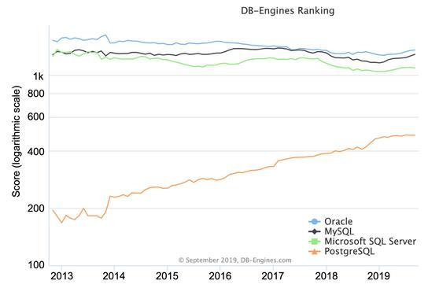

- Add *'s'* string inside the query

  ```sql
  SELECT FirstName || q'['s home country is ]' || Country FROM Employee;
  
  SELECT FirstName || '''s' || ' home country is ' || Country FROM Employee;
  
  --OUTPUT: "Peacock's home country is Canada"
  ```

  

## Aggregating Data

- Select country with total customer more than 4

```sql
-- Adapt the query below to show the correct results
SELECT Country, COUNT(*) as Customers
FROM Customer
GROUP BY Country
HAVING COUNT(*) > 4
```


## Combining Data

- SQL Joins
  - Inner, Outer, Cross, Self
- 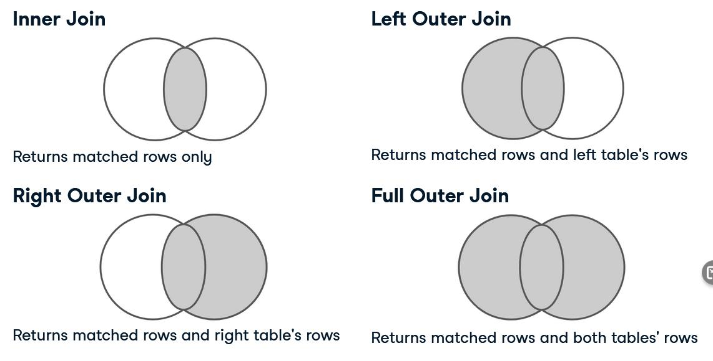

- Cross Join
  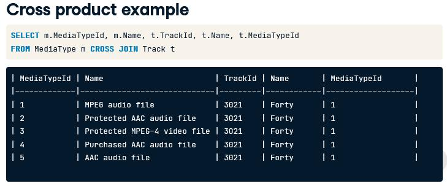
- Self Join
  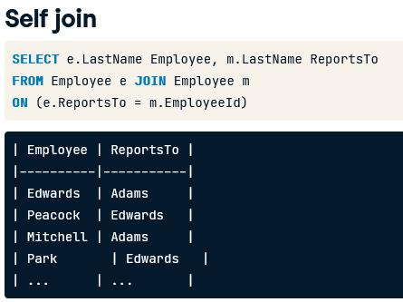

- Types of Set operators
  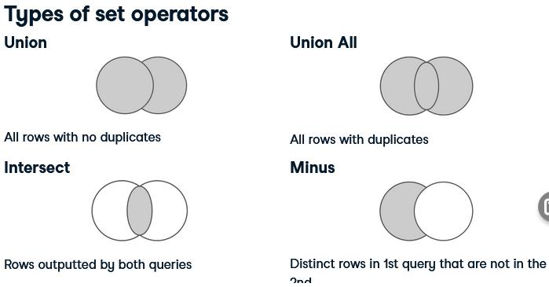


## Taking it to the Next Level

- Query Processing Order

  - What can go wrong?
    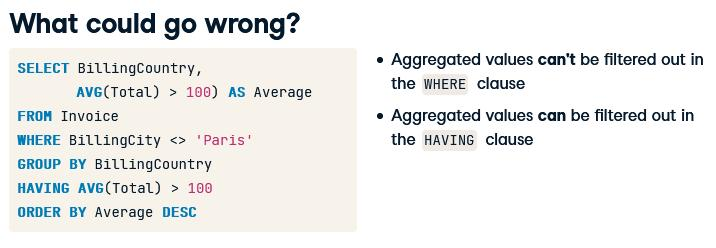
  - Order
    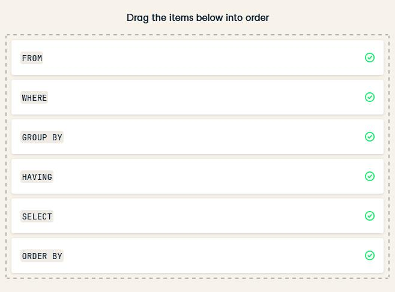

- Aggregated values can't be filtered out in the `WHERE` clause, this needs to be done in the `HAVING` clause.
  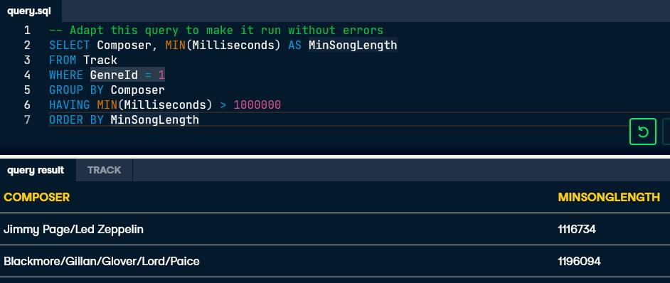

- Working with NULL values

  - NVL

    - `NVL(x, y)` : convert x, which may contain a null value, to `y`, a non-null value

  - NULLIF

    - NULLIF(x, y) : compares x and y, returns
      - NULL if x = y
      - x if they are not equal
    - Example
      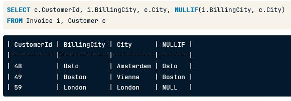

  - COALESCE

    - returns first non-null value in a list
    - example
      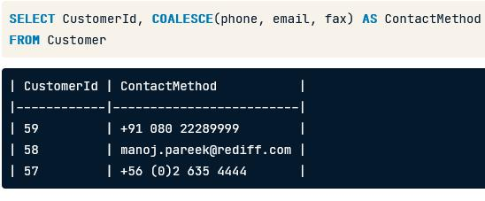

  - Practice:

    ```sql
    -- Replace NULL values in the Company field
    SELECT NVL(Company, 'No affiliation') AS Affiliation, COUNT(*)
    FROM Customer
    -- Filter on the country USA
    WHERE Country = 'USA'
    -- Group by affiliation
    GROUP BY Company
    ```

    ```sql
    -- Replace NULL values in the Company field
    SELECT COALESCE(Company, 'No affiliation') AS Affiliation, COUNT(*)
    FROM Customer
    -- Filter on the country USA
    WHERE Country = 'USA'
    -- Group by affiliation
    GROUP BY Company
    ```

- Using Conversion Functions

  - Explicit data type conversion
    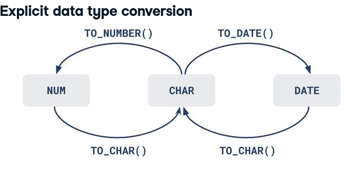
  - Implicit data type conversion
    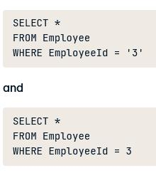

- Group by YearMonth
  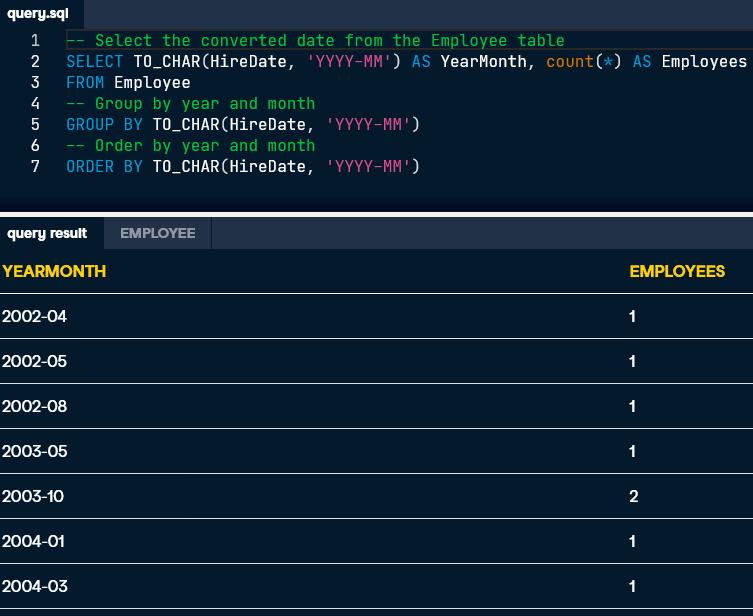


