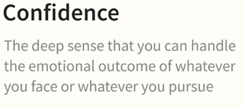
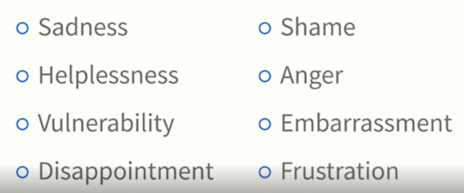
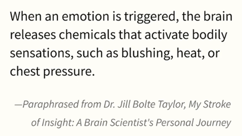
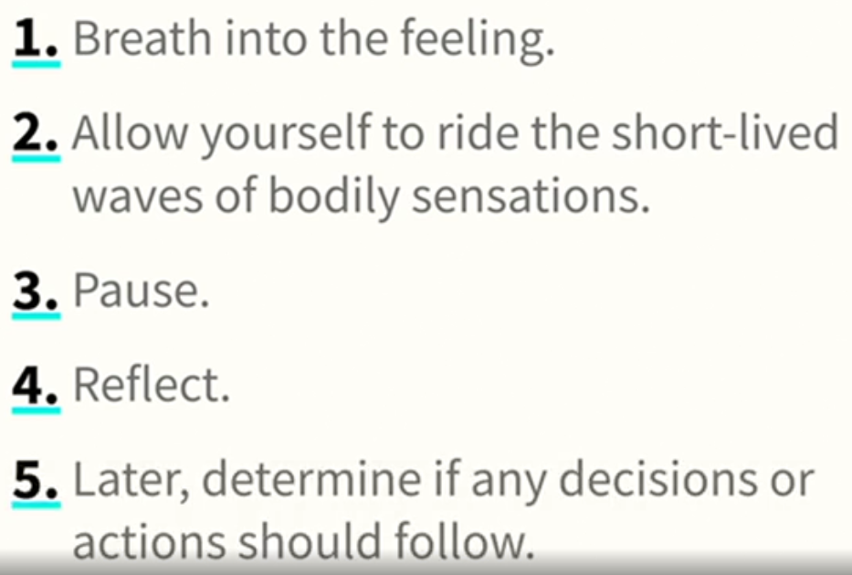
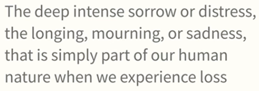
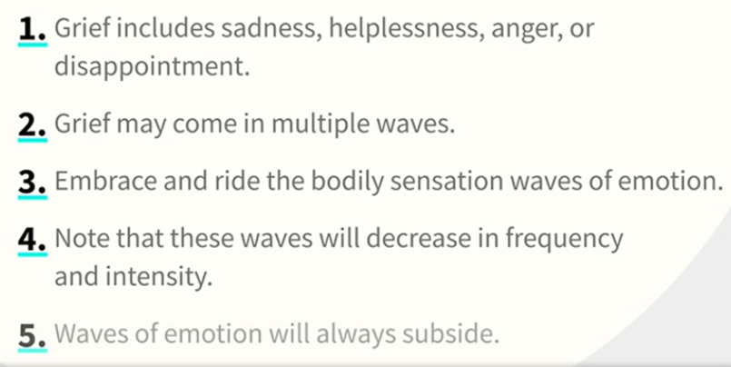
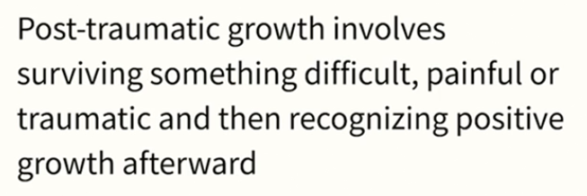
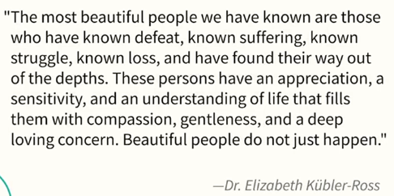

# Dealing with Grief, Loss, and Change as an Employee    

https://www.linkedin.com/learning/dealing-with-grief-loss-and-change-as-an-employee/

## Understanding Your Difficult Feelings

- Confidence
  

- The 8 Unpleasant Feelings
  

- 10-minute Reflection

  - What has been your experience with these emotions?

- The Rosenberg Reset

  - Emotion
    

- How to Handle Unpleasant Feelings

  

## What is Grief?

### Is this Grief?

- Loss can appear in concrete, tangible or abstract and intangible ways
- Loss simply imply change
- Life is really about change, tolerating the unfamiliar and unexpected
- Most people seek stability, predictability, and consistency
  - many would prefer that status quo for their life
- The most common in loss and change is GRIEF
- What is it?
  

### Grief's non-linear progression

- To cope with feelings of grief
  
- Kubler-Ross Model: 5 Stages of Grief
  - Denial
  - Anger
  - Bargaining
  - Depression or Sadness
  - Acceptance
- Bowlby's Phases of Grief
  - Defiance and anger
  - Pain, despair, and disorganization
  - Slow reorganization and reinvestment in life
- Second First book, by Christina
  

### Anticipatory grief and lost potentials

- Coping with Anticipatory Grief
  - Take deep slow breaths
  - Notice your surroundings and see that you are safe and have resources
  - Balance 'what if' questions with positive 'what if' questions
  - Focus on what you can control, such as exercise and nutrition

### The role of vulnerability

- Most people used fear and anxiety, but these 2 word were overused according to the instructor
  - Fear = a sense of a threat or danger in the **present** moment
    - If you're not in real danger, please avoid use this word
  - Anxiety = a diffuse sense of apprehension about some bad event occurring in the **future**
    - If we asked someone 10 things that you're anxious, we will have many different answer
- Neuroception
  - Our hard-wired and innate subconscious ability to detect safety, danger, and life threat -- Dr. Stephen Porges
- Non-Conscious Vulnerability

## Dealing with Personal Loss or Change

### Common physical reactions

- Hurting yourself is most common one, please ask professional help

### Common emotional reactions

- Factors complicating grief
  - Loss or death is tragic, traumatic, quick, or unexpected
  - Multiple losses or deaths in a short period of time
  - Strained relationship with the one who died
  - Death caused intentionally

### Moving through grief

- It's really personal, everyone is different
- Grief and Life walk beside each other
- Second Firsts book by Mrs. Rasmussen - Phases of Grief Recovery
  - Exiting your old life
  - Simultaneously living your old and new life (described as 'waiting room')
  - Experimenting with living your new life
- Developing new habit and choosing to become vulnerable, to become the person you want to be and the future you want to create

## Supporting Colleagues Who Have Experienced Loss or Change

### How to provide meaningful support

- As you begin to engage with a person with whom the loss has touched, you may be tempted to say nothing about the loss
- What we can do is to show up, to be present when they tell the story, without any effort to solve the problem
- 4 Steps
  - First, acknowledge the loss and offer your genuine condolences
  - Second, if you're not sure what else to say, indicate that you will hold the person in your thoughts and prayers
  - Third, offer to be available to listen when the person needs to talk
  - Fourth, offer to assist with more concrete support that might involve errands or meals
- Asking how are you doing, can become complicated question to answer, so try to avoid it

### What not to say

- 8 things
  - Act like nothing happened
  - Minimize the pain
  - Turn attention to your losses
  - Assign blame
  - Rush the process
  - Reason things away
  - Offer platitudes
  - Suggest that grief will last forever
- The key is to show up and be present with him/her

## Returning to Work After Loss or Change

### Make a plan for returning to work

- The more honest you are before and after you return to work, the much smoother your transition will be

### Empathy and the universality of grief, loss, change

- Each one of us has a story to tell, every experience is unique

- Remember, to show up, be present for those who need it

- You're not alone

- It takes strength of your vulnerability:

  - to experience and express it
  - ask for help
  - receive that help
  - put grief behind you and choose into leaning more fully into what gives you life

- Be gentle and compassionate with yourself, as you would with each other

- Closing quote from Dr. Elizabeth Kubler-Ross

  

