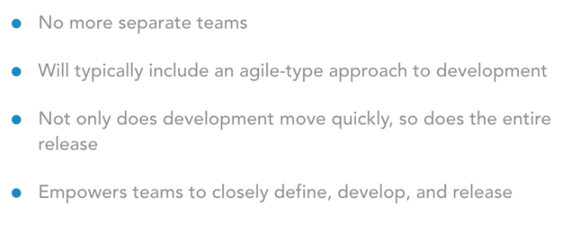

# DevOps Foundation: DevSecOps    

https://www.linkedin.com/learning/devops-foundations-devsecops

## DevOps Basics

- What is it?
  - DevOps brings groups together
    
    
  - Large culture change
  - Required skilled team
  - Everything needs to happen quickly
  - Automation in an existing environment is usually lacking
  - Security is not immune to the effect of DevOps
- Security is different in a DevOps world
  - Time matters in an agile, or CD, model
  - Automation - Education - Empowerment of dev team
  - Quote
    

## Starting your DevSecOps Journey

- Some free tools
  - Find Security Bugs app
  - OWASP Zed Attack Proxy Project
  - SQLMap
  - OpenVAS
  - Recon-ng
  - OWASP Glue Tool Project
- A few resources to get started
  - A DevSecOps book by Dave Shackelford
  - Continuous Application Security Handbook
  - Awesome-devsecops (github list)
- Real-life example
  - Using combination of Docker and OWASP Glue Tool Project

## Next Steps

- Enhance and grow toolset
  - Always experiment yourself, what works and what doesn't work
- Expand to more teams
- Manage multiple security containers
- Grow automated checks
- ChatOps
  - Slack, Stride, HipChat
- Continuous Monitoring
  - Contrast RASP, Recon-ng
- Automation of manual security tests