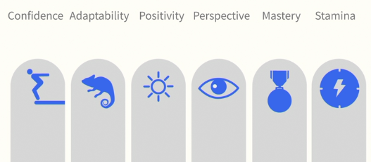
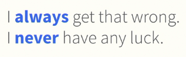
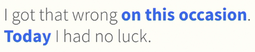
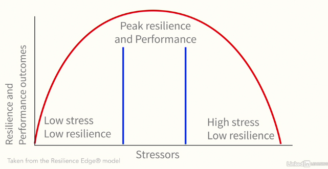
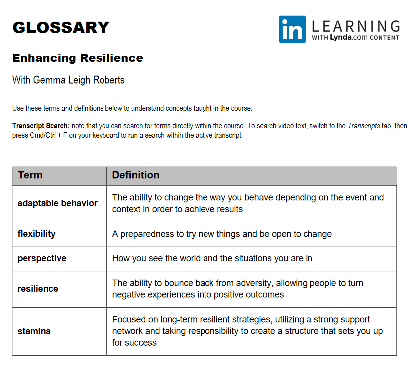
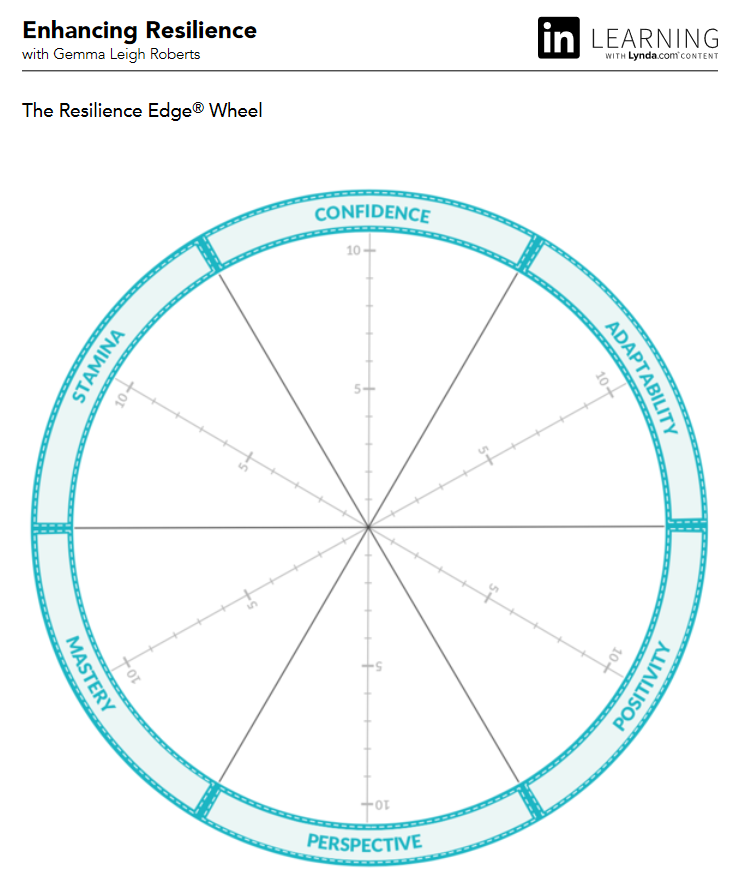
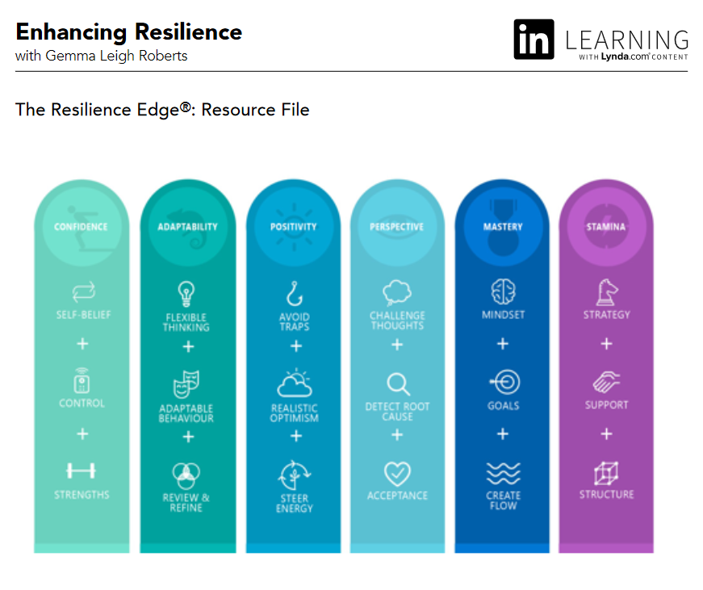

# Enhancing Resilience

https://www.linkedin.com/learning/enhancing-resilience/why-resilience-matters?u=26110466

By: Gemma Leigh Roberts

https://www.linkedin.com/in/gemmaleighroberts

## The Resilience Edge

- 6 pillars
  
  - Confidence
    - Self-belief
    - Control
    - Natural Strengths
  - Adaptability
    - Flexible thinking
    - Adaptable behavior
    - Review and refine
  - Positivity
    - Avoid traps
    - Realistic optimism
    - Steer energy (manage your energy)
  - Perspective
    - Challenge thoughts
    - Detect root cause
    - Practice acceptance (learn what you can and can't control)
  - Mastery
    - Growth mindset
    - Goal setting
    - Create flow (feeling entertained and stretch at the same time)
  - Stamina (keeping your on track)
    - Strategy
    - Support system
    - Structure
  - Quiz
    - You are currently in the middle of the Resilience Scale. What will be the effect of the environment you are in on your ability to move along the scale?
      - **You can move to the Thriving end of the scale by the strategies you take to respond in the environment.**        

## The Six Pillars of Resilience

- Create confidence

  - Enchancing confidence will boost your performance and resilience
  - What is confidence?
    - self-belief
      - the ability to tackle challenges and difficult situations
    - control
      - control your feel over the situation around you
    - strength
      - capitalizing on what you're naturally good at
  - Self-reflection questions: 
    - what are your **defined** natural strengths? (ask other to identify this)
    - how could you use your strengths more? (using your talents will help you cope with challenges)
  - Key: *remember you have ability to boost and build your confidence*

- Apply adaptability

  - learning from mistakes and failures
  - flexible thinking
    - adapting how you think to achieve certain outcomes
  - adaptable behavior
    - being conscious of how you behave in the situation to achieve your results
  - review and refine
    - developing a continuous improvement mindset
    - continually review your progress (one percents better every day = 365 percents better every year)

  - *The more flexible in your thinking and behavior, the more you focus on your challenges as your learning experience.*

- Practice positivity

  - Avoid the trap of blind hope (*harapan palsu*)

  - We all have natural levels of positivity

  - 3 skills:

    - Avoid traps

      - navigate away from persistent negative statements

      - replacing permanent statement

        

        

         

    - Realistic optimism

      - avoid blind hope, stretch yourself, and create an action plan

    - Steer your energy

      - consider how you use your energy through the day
      - playing video games, binge watching can be energy wasting
      - listening to podcast, read book can be energy boost

    - Try to avoid permanent word, and use temporary word instead

      - NOT OK = always / never
      - OK = sometimes / on occasion

- Play with perspective

  - Your perspective is up to you to direct
  - Challenging thoughts
    - learning through difficult situation will help you to get better
  - Detect root cause
    - understand the different factors that affect your responses
    - relationship with people that important to you
    - key to detect it: understanding what's really going and how it affects you
  - Practice acceptance
    - accept situations outside of your control, and let go the past event
    - learn from experience, let go, and move on
    - gratitude practice like write 3 things you're grateful for each day

- Maximize mastery
- Strengthen stamina
  - strategy
    - determining the best way to enhance your resilience
  - support system
    - key people who will help you learn and grow
    - talking to friends and family
    - working with your coach and mentors
  - structure
    - A system, process, or plan to help you thrive
      - for example: I used Trello to manage my daily works and plans, I used MoneyLover app to manage my financial account
- Benefit of Resiliences
  - Improve performance
  - Strengthen relationships
  - Face challenges
- Resilience Edge Models
  
- Quiz:
  - Martina has encountered a series of negative events in her job that are affecting her relationships with coworkers. What would you suggest she do to improve her relationships?
    - She should take steps to understand the root cause of why she is responding that way to her coworkers. 
      Because her negative perspective is flowing into her  relationships with coworkers, Martina needs to find the root cause of  her behavior. 
  - Why would you solicit feedback as you consider your adaptability?
    - Colleagues can advise you regarding how well you have adapted to situations.
      - You want to understand how your ability to adapt is viewed by others.        

## Enchancing Your Resilience

- Resilience is a mindset and way of life, not a destination, not a goal
- Your experiences and responses will help you to enhance your resilience, no matter good or bad it is
- Tips for maintaining resilience
  - celebrate small wins
  - create learning opportunities
    - response to challenges that push you, but don't cause high-level of stress
      - for example: hackathon of the field you loved. side-hustle
  - create your success habit
    - set a specific time to review your progress
  - don't be afraid of making mistakes
- Review resilience progress
  - short-term action plan
  - long-term strategy
  - review plan
    - without reviewing, your long-list plan will be wasted
    - questions:
      - what went well?
      - what could you do even better?
      - which areas of resilience carried you through?
      - which areas of resilience could support you more?
      - how was your performance affected?
      - how would you approach the situation in the future?
      - which parts of the resilience edge will you focus on?
  - review process
    - set aside time
    - regularly reflect
- Quiz
  - Research has identified a sweet spot in building resilience. Where is this sweet spot?
    - The sweet spot is seeking opportunities that challenge you, but that will not cause high levels of stress.

## Conclusion

- Start your resilience journey
  - Face challenges
  - Reflect regularly
  - Practice key techniques
- Which of the 6 pillar is work best for you?
- 

## Glossary

## The Resilience Edge Wheel

## The Resilience Edge - Resource File

 [Resilience Edge Resource File.pdf](files/enchancing_resilience/Resilience Edge Resource File.pdf) 

