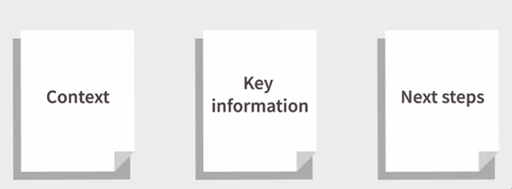

# How to Have Fewer, Better Meetings

Instructors: Kevan Hall and Alan Hall

https://www.linkedin.com/learning/how-to-have-fewer-better-meetings/how-to-have-fewer-better-meetings?u=26110466

## Intro

- Meetings steal time at work
- Some questions to ask before:
  - What percentage of a typical week do you spend in meetings?
    - surveys: 2 days per week (40% for working day in a week)
  - What percentage of time that you spend to prepare for a meeting?
  - What percentage of time is spent on content relevant to you and your job?
- Try to getting know, how to remove some unnecessary meetings 

## Cutting Down the Number of Meetings You Attend

### Saying no to more meetings

- Worthwhile Meetings
  
- Meetings to Avoid
  

### Health-check the content of your meetings

- Example:
  

### Topics that don't need a meeting

- For example: broadcast meeting when participant just to become passive listener and only asking casual questions
- Two individual get into details for themselves, but not relevant for others

### People who don't need to be there

- **Balanced contribution** form **all members** tends to correlate with **better performance**

### Overcoming objections to fewer meetings

- Common objection
  - meeting will help people to get involved
- Solution:
  - add Q&A session
  - get the value: people like to having opportunity to have conversation

### Quiz

- If you identify someone who does not contribute actively to the meeting, what should you do?
  - Ask what you can do to get them more involved, or, if not, ask if they need to attend in future.
- What are the positive byproducts you get from unnecessary meetings?
  - networking, involvement, visibility
  - The byproducts that most people miss if they cancel more meetings are  networking, visibility and a sense of involvement. You need to find  alternative and better ways to satisfy these needs.
- The best type of meeting topics are usually `_____`.
  - topics relevant to everyone
- Which types of topics require a full live meeting of all members of your team?
  - discussions involving and impacting on everyone
- To have fewer, better meetings what should you do?
  - Cut out unnecessary topics and participants
  - Push back on more of the invitations you receive
  - improve the design of your meetings
- When should you consider turning down a meeting invitation? 
  - when there is no clear role for you in the meeting

## Planning a Great Meetings

- Focus:
  - Outcomes of the meeting: what will happen as a result of the meeting?
    - for example:
      - make a decision
      - solve a specific problem
      - develop a plan of action
  - Process: what series of steps do we need to take?
  - Participation: who needs to attend?
  - Time: how much time do we need?
  - It should be an active role from every participant
- Making every meeting relevant
  - Strategy, Common Learning, Action Plans, Priorities 
  - Build in some unstructured time to have fun together
  - Break into subteams
- Engage everyone
  - Focus on participant experience
  - Keep groups small
  - Activate your audience
    - Giving the opportunity to ask something
  - Cocreate
    - Create the opportunity for people to create their own work
  - Engage all senses
    - don't let sitting for too long, it's a passive sense
  - Make the room match the process
- Participation when we're not face-to-face
  - Master the technology
    - there's always some people who struggle with tech
  - Engage every five minutes
  - Activate early
  - Use engagement tools
    - poll, quiz, breaking into sub group, chat, etc
- Banish boring presentations in meetings
  - 40% of content = information giving
  - Take control of what gets presented
  - Use standard formats
  - Pre-circulate information
    - make people do pre-reading
  - Check for understanding
  - Set expectations and be consistent about this
  - 3 pages memo in presentations:
    

- Quiz

  - How often do you need to engage people during a virtual meeting in order to keep attention levels high?

    - every 4-6 minutes

  - What is the best way to rid your meetings of boring and over-detailed presentations?

    - Provide the relevant information before the meeting to enable people to prepare.

  - The best meetings are where the content is `_____` to you and the other attendees.

    - relevant

  - To engage everyone in your meetings what should you do?

    - Give people an active role
    - Focus on the participant experience
    - Keep groups small

  - Which element is NOT essential in planning a great meeting?

    - regular breaks
    - Essential: a well-defined process, clear outcomes, a plan for people to participate actively

    

## Running a Great Meeting

- Meeting Facilitation
  
  - Distribute the role across meeting participants
  - Make sure all participants engaged
  - Save all outcomes into a simple report
  - Setup a time keeper
- Keep on improving your meetings
  - Setup feedback form with some simple questions
  - Revisit meeting plan, and check if it achieve the plan

## Conclusion

- Continuous learning about finding the effective way to improve meeting is a must
- As meetings technologies develop further you should always be looking for new tools and opportunities to keep your attendees `_____`.
  - engaged

