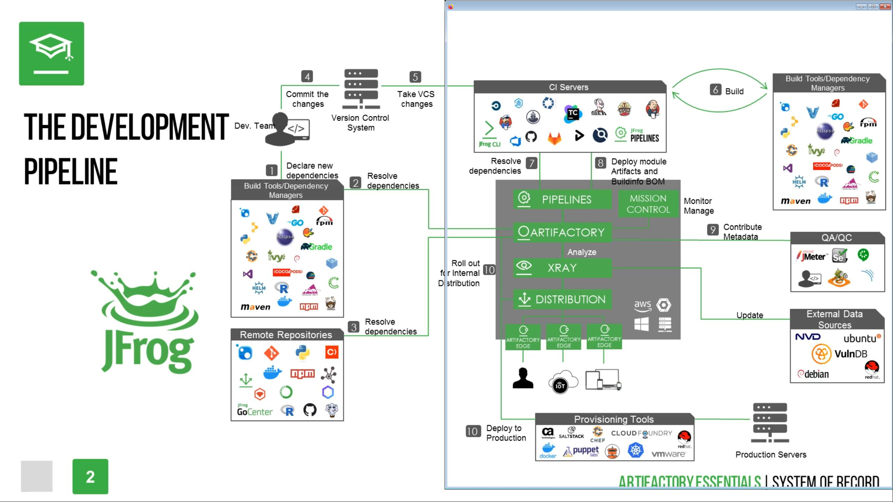

https://academy.jfrog.com/jfrog-artifactory-overview-2020/

# What is Artifactory?

- A universal artifact repository for faster release cycles
- Developer using common system to store packages from many different sources
- Advantages
  - Properties
  - Traceability
  - Repository filters
  - Local access
- The first universal artifact repository
  - Services
    - build tools
    - dependency managers
    - CI servers
    - Operational tools
    - and more
  - Artifacts
    - 3rd party libraries
    - internally developed artifacts
    - Build results
    - In-house plugins
    - and more
      - rpm, debian, docker, ruby on rails, java, etc
- Supported services
  - metadata
    - build environment
    - access permission
    - licenses
    - signatures
    - completely customizable

# System of Record

- Overview of records, developers generate:
  - artifacts
  - binaries
  - builds
  - packages
  - bundles
  - other resources
- Development Pipeline
  
- One central interface!

# Automation

- Built with automation in mind
- REST API
  - build automation
  - artifact deployment
  - plugin endpoints
  - integrate with any CI/CD dev tool
- JFrog CLI
  - interfaces with JFrog services through REST API
  - optimizes tasks
  - checksum performance
  - simplifided command structure
- Plug-in Framework
  - Build triggers and handlers to automate:
    - schedule tasks
    - manipulate downloads and upload
    - create new jobs
    - extend security controls
  - JFrog offers sample plugins written in Groovy
- Built-in Integration
  - CI/CD build integration
    - Jenkins
  - all builds
  - artifacts
  - dependencies
  - build environment
  - build operations
  - dependency relationships
- Advantages
  - developers can focus on code
  - managers can focus on supporting developers

