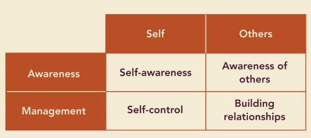
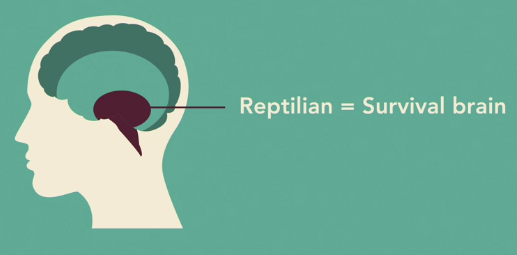
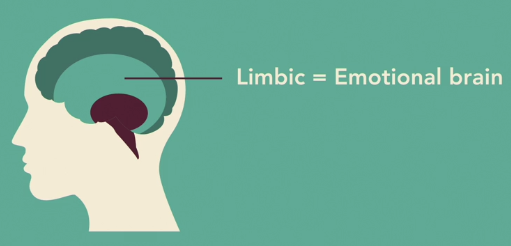
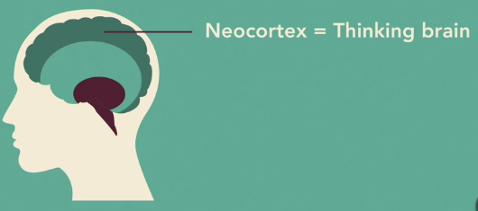
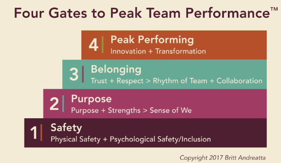
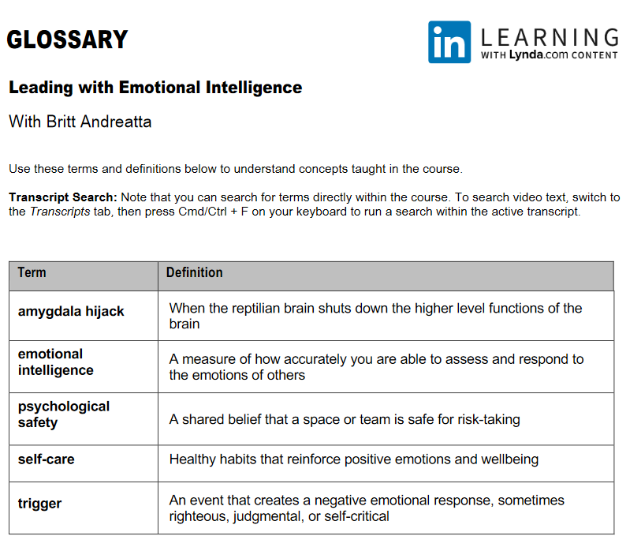
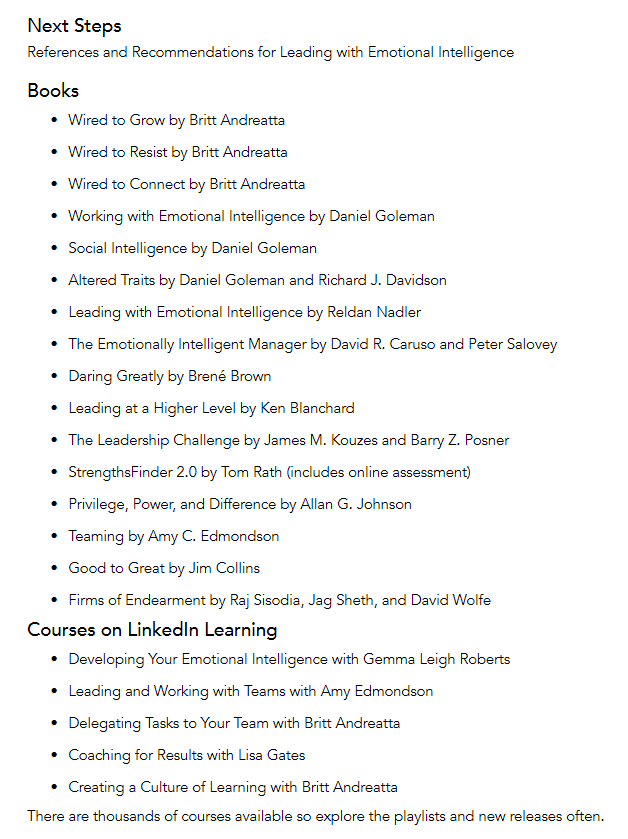

# Leading with Emotional Intelligence

Tutor: Britt Andreatta

## The Emotionally Intelligent Leader

- The more emotionally intelligence person, the more effective they are
- Four quadrants
  
- The brain science of EQ
  - Reptilian brain
    R
  - Limbic brain
    
  - Neocortex = Thinking Brain
    
    - both of IQ and EQ live here
  - Amygdala Hijack
- Leading people and orgs
  - As a leader we have 3 kind of responsibilities: self, others, organization
  - 4 key strategies:
    - Role model emotional intelligence
    - Make EQ part of your core values
    - create an environment that boost HQ
    - Hold your people and organization accountable
- Quiz
  - What is the best description of the "amygdala hijack?"
    - when the reptilian brain shuts down the higher level functions of the brain
    - Yes, the hijack is when the amygdala kicks off the fight/flight response, but it's not actually a life-threatening situation.         
  - What do you call it when you develop others to maximize their potential?
    - building relationships
    - Exactly. Maximizing their potential and relationship is an example of building relationships. 

## Knowing Yourself

- Raising your EQ means you take time to feel your emotions
- Journaling, speaking, mindfulness, exercise screaming to pillow
- Feeling happy and treat yourself is important in this busy life
- 3 goals
  - Correctly identify your emotions
    - Pay attention to pattern, for example I felt happy when go to library or bookstore
  - Feel your feelings
    - feel both sadness and happiness
  - Expressing your feelings
    - Identify source of feeling
    - Pick the right time and place to communicate
- Picking the right time and place for expressing your feelings and emotions

## Managing Yourself

- Emotional self-control is important
- It's human nature to don't have self-control to your favourite things
- Self-control is like hijacking yourself
- Two important windows:
  - Under stress
    - Calming yourself down
      - excusing yourself
      - breathing (5s is enough)
      - journaling 
      - moving your body
      - talking to your trusted friends
    - Train yourself to wait
  - Everything is going well
- Understanding triggers
  - Fight
    - Use aggression to protect ourselves
  - Flight
    - Turn away from danger and withdraw
  - We must know our triggers, and learn to manage them when it's coming
- Managing your triggers
  - Anticipate what or who will trigger you
  - Develop a "fire drill"
  - Add mindfulness to your life
  - Quotes
    - Triggers are at the heart of conflicts
    - The work environment can set off triggers
- Self-care and support
  - Prioritizing self-care
    - Make it non-negotiable
    - Consider adding a mindfulness practice to your daily routine
    - Build play into your life
      - make a play session at least once a week
    - Seek support from a trusted network
      - Your support network have important role in raising your EQ
  - Expressing Feelings
    - Structured journaling process
    - Working with an executive coach
    - Having a personal therapist

## Understanding Others

- Understanding humans at work
  - The best thing to know others is to ask them
    - what's your name? where are you from? what's your hobbies?
  - 3 wired human things:
    - we're wired to survive
      - keep safe food, job, etc
    - we're wired to belong
      - part of something bigger
    - we're wired to become our best self
      - self-grow
- Extending empathy
  - Empathy is about connecting to their experience as they feel it
  - Let go of the golden rule, instead use platinum rule
    - Do unto others as they would want to have done unto them
  - Benefit of empathy
    -  better satisfy your customer's need
    -  more effectively support your leader and help your co-worker to achieve their best
    - be a better friend, romantic partner, and parent
  - Strong business benefit:
    - Increased productivity
    - More loyal to company

## Leading Others

- Creating safety and inclusion
  - Respecting and trusting people at work
    - Remove bullying culture
  - The best leader is always trying to create inclusive environment
    - in my case, if I create Christian group meeting, I'll make it exclusive, as non-Christian can't join
    - So, it's better to create inclusive group meeting where everyone can join, such as Bukber
- Facilitating teams
  - Four Gates to Peak Team Performance
    
- Catalyzing change
  - The ability to change is the key success of company
  - Facts: 50-70% of change initiatives fail
  - High EQ Leader:
    - Be ahead of the curve
      - thinking beyond the current curve, and predict the future
      - learn from Apple: they started to make an autonomous car from now
    - Champion the change
      - FInd ways to talk about your idea that are clear and compelling
      - Inspire others with your passion, and be sure to look for and cultivate your advocates
    - Model the change
      - Sometimes the new idea is scary, so let's hear from other, and do the test drive
  - Is change needed?
    - Look at your organization and market
    - Look at workforce trends
    - Identify any skill gaps
    - Study customers
    - Ask what disruptive forces may exist
- Inspirational leadership
  - It sounds intimidating, but don't confuse the leadership with charisma
  - Passion is the core of being the inspiring leader
  - Share your passion and vision with others
    - Clear and compelling
    - Help them to understand it
    - Not everyone will like it
    - You can get busy to convince others, so try to focus on more important thing
  - Walk your talk
    - Book rec: Good to Great by Jim Collins
  - Leadership is a practice, not a position
  - The world needs of what you have to contribute

## Conclusion

- Work with other EQ people to carry this message forward together
- Assessing what your organization needs to improve
- Steps
  - identify areas that needs attention
    - for example: conflict, inclusion
    - find what's work and not work
  - Propose a plan for raising your organization's EQ
    - calculate your ROI of implementing your idea
  - Take a snapshot
    - as a measuring stick
  - Focus on one thing at a time
  - Demonstrate successes with statistics and stories
    - Use quantitative data to show it
    - using stories will relate to most of people as we're human being

## Glossary

## Next Steps

