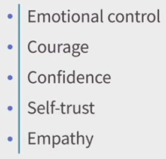
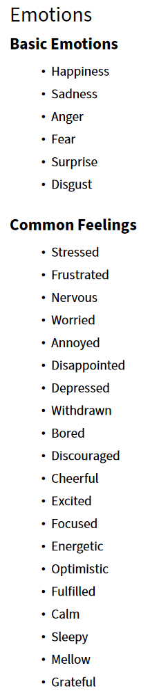
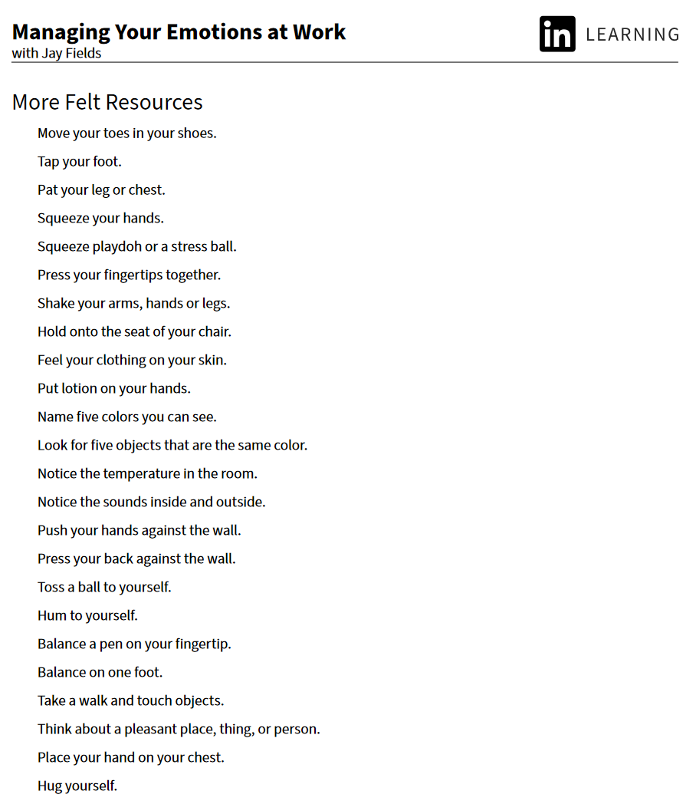
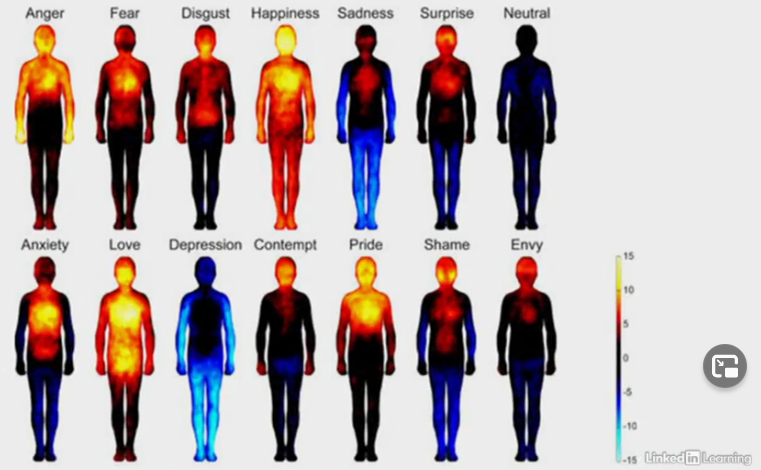

# Managing Your Emotions at Work

https://www.linkedin.com/learning/managing-your-emotions-at-work

Jay Fields - Somatic Educator, Coach, and Author

## The Mind-Body Connection in Managing Emotions

- Your body spent more energy to your brain, compare from brain to body
- Types of Self-Awareness
  - Conceptual
    - Thinking about yourself, self-thinking
      - example: say good morning to co-worker, and then he/she didn't response, you start to guess maybe you're not say loud enough
  - Embodied
    - Self-experiencing the self
      - Information from your body, warm/cool, tired/wired
      - Feeling your body touching something
    - An emotion is a physical sensation
    - Benefit
      
- Tips: set a reminder about your energy/mood level
- Emotion type
  

## Practicing Self-Empathy to Manage Your Emotions

- Acknowledge instead of resisting
- Quiz:
  - You just spilled your coffee on the report that you need to read by lunch. At the same time that you also get a message that you're late for a meeting you forgot about. You notice you feel worn down and that you wish the day were over. What is an example of quickly and effectively offering yourself empathy?
    - Say  to yourself, "Of course you're worn down. Work has been really hard  lately, you haven't been sleeping, and you really need a break."
    - The two words "of course" help to put your feeling in  context, which helps you to make sense of your experience. Feeling  understood, whether by yourself or by another, is what empathy is all about
  - Why does being able to name your emotion help you to manage it?
    - It helps to integrate your brain.
    - Naming your feeling brings together the part of your brain  that is having the feeling with the part of your brain that can **understand the feeling**, and this integration in your brain makes it  easier for you to **regulate your nervous system and manage your emotions**.
  - The next time you find yourself avoiding having a feeling, what is an effective tool for addressing emotional resistance?
    - Say, "I don't want to feel this."
    - Saying "I don't want to feel this" is you being present to the sensations or behaviors that **let you know you are avoiding a feeling**,  which actually helps you to be more regulated
  - What is self-empathy?
    - understanding why you feel the way you do
    - The core component of self-empathy is **understanding why you  feel the way you do**. It's so effective for managing emotions because it  helps to integrate your brain by bringing together the part of your  brain that's having the feeling with the part of your brain that  understands why

## Tips for Expressing Your Emotions at Work

- Dealing with Other People's Emotion
  - Identify your stress response
  - Interrupt it
  - Use a felt resource
    - Something you sense in the present moment that is pleasant or natural
- Quiz
  - It is appropriate to share your emotions at work if `_____`.
    - you sense that not sharing it will harm the trust or connection you have with a colleague or client
    - Sometimes when you try to hide a feeling it impacts how you  behave or come across, which then can impact your trustworthiness or effectiveness. In these instances it's appropriate to share how you're  feeling to create more connection
  - Your manager just got done heatedly telling your team why she's so disappointed in your performance, complete with a raised voice and pounding on the conference table. What is the best thing for you to do to try to manage this situation?
    - Use a felt resource to try to regulate your nervous system and interrupt any stress response you might be having.
    - Your nervous system is constantly reading your surroundings for threat,  and when you have a stress response like fight, flight, freeze or fawn  you don't have the ability to choose how you react in difficult  situations. The best course of action when in a tense situation is to  start by trying to stay regulated.

## Resources for Managing Emotions

- Managing unpleasant emotions with **felt resources**
  - Orienting
    - Look away from your computer such as object, window, table, etc
  - Grounding
    - Giving you a feeling physically supported, touching floor, chair, kneel
  - Centering
    - It feels like your energy going way from your workplace, like Peter Pan's shadow
    - Centering mean pull yourself from being far away from yourself
    - Research
      - simply standing taller and choosing to focus to body part that made you feel strong will help to decrease cortisol (stress hormone) and increase testoterone (feeling of confidence and empowerment)
    - Adding a peace that make you a smile
- External focus: action-oriented practices for managing your emotions
  - example:
    - tapping your foot made you feel better, than It's a resource for you
- More Felt Resources
  
- Quiz
  - What is NOT an outcome of a felt resource?
    - being able to distract yourself from a difficult emotion
    - A felt resource doesn't distract you from a difficult emotion, nor does it make the difficult emotion go away
  - Why is orienting considered an effective practice for regulating your nervous system?
    - It gets you out of tunnel vision, which can be one of the stress responses.
    - When humans feel threatened or emotionally activated, they tend to get  hyper focused and their eyes can get stuck in tunnel vision. Looking  around helps **to interrupt this stress response and to regulate the  nervous system**.
  - What is most important in order for grounding to be an effective felt resource?
    - that you experience a pleasant sensation of being supported
    - Whether you are standing, sitting or lying down, in grounding you focus  your attention on what it feels like to be supported. If it feels  pleasant, grounding is a felt resource for you
  - Research shows that standing taller and choosing to focus on places in your body that feel strong are associated with `_____`.
    - decreased cortisol and increased testosterone
  - When it comes to a felt resource, what matters most?
    - The felt resource should be pleasant, purposeful, and practiced frequently.
    - A felt resource is something that you are choosing to do  because it feels pleasant and helps you to feel more present and  regulated. A felt resource becomes more accessible and more effective  the more you practice it

## Conclusion

- Be patient with yourself
- Stay with yourself when your emotions get uncomfortable
- Commit to deepening the groove of Emotional Intelligence
  