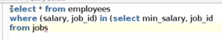

# Oracle SQL

## Unlocking user account

https://www.oracletutorial.com/oracle-administration/how-to-unlock-a-user-in-oracle/

## Dual

In Oracle 10g release 1 and above, Oracle treats the use of `DUAL` the same as calling a function which simply evaluates the expression  used in the select list. This optimization provides even better  performance than directly accessing the physical `DUAL` table

https://www.oracletutorial.com/oracle-basics/oracle-dual-table/.

## Manipulating Data

https://www.linkedin.com/learning/oracle-database-12c-basic-sql/introduction-to-transactions?u=26110466

Terms

- Transaction = every SQL command in Oracle, must be DML command
- Commit = submit the SQL command into Oracle DB, must be DML command
- Rollback = cancel the SQL command, so it will not be executed in the table, must be DML command
- Queries = retrieving data from database tables
- DDL = Data Definition Language, creating new database objects
  - CREATE
  - ALTER
  - DROP
  - TRUNCATE
- DML = Data Manipulation Language, modifying existing data in your database
  - SELECT
  - INSERT
  - UPDATE
  - DELETE

## Basic SQL clause

- String inside quotation mark 'E%'

  - case sensitive, means 'E%' and 'e%' are different
  - happened in LIKE, IN

- LIKE only for string values

- IN can be used for numeric values

  - also can use NOT IN

- `to_date()` function

  - for example:

    ```sql
    select * from employee
    where hire_date > to_date('01-JAN-2000', 'DD-MON-YYYY')
    ```

- Using `DISTINCT` to eliminate duplicates

  - Example:

    ```sql
    select distinct department_id, salary
    from employees
    ```

- Performing basic numeric calculation inside the SELECT is possible

- Describe the structure of a table using `DESCRIBE <table_name>`


## String, Number, and Date Functions

- LENGTH = get the length of the string value

- SUBSTR = get the character from string values

  - SUBSTR(<col_name>, starting_pos, length)

- CONCAT = combine multiple string values

  - alternative using ||

- LOWER  / UPPER = change the string value to lower/upper case

- INSTR = get the position of the first character inside string values

  - phone_number: 011.44.1344.345268
  - INSTR(phone_number, '5')
  - result = 15 (start with 1, dot(.) character counted)

- RPAD and LPAD = padding from right/left side of string values

  

- TO_CHAR

  - to convert number into a string and give it specific format
    
  - to format DATE values
    
  - to filter DATE values
    

- The Special Oracle DUAL table

  - created during the installation of Oracle DB
  - used to select any value without create/specifying database/table

- ROUND = round the number value into certain decimal points, with round up/down values

- TRUNC = truncate the number value from defined position, without rounding the values

- SYSDATE = displaying current date and time

  - combine with TO_CHAR
    

- SYSTIMESTAMP = get the current timestamp with highest precision

- MONTHS_BETWEEN = calculate how many months have been passed between two distinct dates

  - Example case: get the number of years employed
    

- ADD_MONTHS = add a specified number of months to specific date

  - Example case:

    ```sql
    add_months(sysdate, 2)
    ```


## Joining Table Data

- All types of join
  

- Oracle join syntax vs ANSI syntax
  
  - Oracle has different syntax that give same result
  - For compatiblity, it's recommended to use the ANSI syntax


# **Learning Oracle Database 19c - PL/SQL**

https://www.linkedin.com/learning/learning-oracle-database-19c/pl-sql?u=26110466

Instructor: Bob Bryla, Senior Oracle DBA
https://www.linkedin.com/in/bobbryla/

## What is it?

- Programming Language/SQL
- Extens Oracle SQL
- Based on the Ada language
- SQL is declarative: “here’s what I want to do"
- PL/SQL is procedureal: “I know exactly how to do this and here’s how I’m going to do it"

## PL/SQL Language Elements

- Loops
- IF ELSE
- Exception Handling
- Storing functions and procedures
- Think it like programming language instead SQL


Remember:

- SQL: report writing needing simple joins, ad hoc queries
- PL/SQL
  - Complex business logic
  - Stored procedures or functions

## The ANSI SQL language standard

https://www.linkedin.com/learning/learning-oracle-database-19c/the-ansi-sql-language-standard?u=26110466


## Creating Functions

- Syntax for CREATE function

  - name the function
  - what will it return?

  

## Creating Procedures

- Encapsulated section of PL/SQL or Java code
- Can be anonymous
- Zero or more arguments, but don't return values
  - 
- Can be stored in a package with other stored functions, procedures, and types

## Declaring Variable


## Declare Cursor

- What is Cursor?
  - a pointer to a private SQL are with metadata for running a SELECT or other DML statement
  - two types: explicit and implicit

- Explicit Cursor


- Implicit Cursor


- Built-In  Cursor


## Using SQL SELECT Statement

- Static SQL Statement


## Error Handling


## Extra learning resources for Oracle

- Oracle Education
- Oracle on YouTube
- Oracle Experts
- Oracle Documentation
- LinkedIn Learning


# Oracle Database 19c

https://www.linkedin.com/learning/oracle-database-19c-basic-sql/


## Client Tools

- SQL Plus
- SQL cl
- SQL Developer


## String Manipulation

- Literals

  - Most common used literals:
    - string, numeric, date, interval

- Concatenation

  - using `||`

    - example: 

      ```sql
      select employee_id, last_name || ', ' || first_name fullname from employees
      ```

  - Why use `||` vs `concat`? --> it's more readable

- Alternative quoting

  - Use a single quotes plus embedded extra quotes
  - Use a quote delimiter


## DML / DDL

- Insert multiple rows using `INSERT ALL`
- Most commons data types are VARCHAR2, NUMBER, and DATE
- Creating indexes
  -  index, provides fast access to rows in table


## Dropping Objects

- Dropping tables
  - By default tables are kepts indefinitely in the recycle bin and are available for recovery unless
    - The DBA has turned off recycle bin functionality
    - The PURGE option was used when dropping the table
    - The space occupied by the dropped table needed to be re-used
  - Restore a table from the recycle bin with `FLASHBACK TABLE`
- Dropping indexes
  -  Drop an index on your own schema or another schema with the DROP INDEX statement
  - When you restore a table and its indexes, the index and its constraints won't have the same name it had originally

## SET DEFINE OFF / ON

- Why do we need `SET DEFINE OFF;` or `SET DEFINE ON;`

  this is used when script contains special characters that may break the execution (in our case it's "&" in the categories part) 

  so whenever a string contains "&", please use SET DEFINE OFF and then SET DEFINE ON in the end of the script 

## Next Steps

- education.oracle.com
- youtube.com/orcale
- asktom.oracle.com
- docs.oracle.com


# Oracle Database 12c: Advanced SQL

https://www.linkedin.com/learning/oracle-database-12c-advanced-sql


## Multi-column Subquery




## Indexes

- What is Index in Oracle?
  - Schema objects created in the database on one or more columns in the table
  - Can greatly improve query performance and access to data
- 


# How to Recover Data (Without a Backup!)

https://blogs.oracle.com/sql/how-to-recover-data-without-a-backup


## Salvaging the Deleted Rows

Insert

```sql
insert into table
  select * from <table> as of timestamp sysdate – interval '1' hour
  where <conditions to find the rows>;
```

Finding deleted rows

```sql
select * from <table> as of timestamp sysdate – interval '1' hour
minus 
select * from <table>;
```

Recover

```sql
insert into <table> 
  select * from <table> as of timestamp sysdate – interval '1' hour
  minus 
  select * from <table>;
```


## Recovering deleted rows from oracle table

https://stackoverflow.com/questions/23334495/recovering-deleted-rows-from-oracle-table/23334728

You can recover the details using Oracle Flashback Query.  You could query the contents of the table as of a time before the  deletion to find out what data had been lost, and, if appropriate,  re-insert the lost data in the database. Here's the sample query: 

```sql
select * from MANUAL_TRANSACTION as of timestamp to_timestamp('28-APR-2014 12:30:00', 'DD-MON-YYYY HH:MI:SS') where ' clause based on your deleted data';
```


# PostgreSQL vs Oracle SQL

## Jan Karremans - Comparing PostgreSQL to Oracle. The best kept secrets to success

https://www.youtube.com/watch?v=NHUVJBrpF64

- Speaker: Jan Karremans, EDB Postgres
- Oracle = Oracle Enterprise Edition
- Postgres = Enterprise Postgres DB
- High Availability
  
- Performance and Scalability
  
- Security
  
- Integration
  
- Application Development
  
- Big and Unstructured Data
  
- Management
  


## Oracle Vs PostgreSQL [#Database](https://www.youtube.com/hashtag/database) [#Which](https://www.youtube.com/hashtag/which) is most [#Powerful](https://www.youtube.com/hashtag/powerful) database?

https://www.youtube.com/watch?v=Uo_jnAKLqAg

- Oracle
  - developed in 1977
  - Editions
    - Enterprise
    - Standard
    - Express
    - Oracle Lite
  - Run on the major platforms like Windows, UNIX, Linux, and macOS
  - It build around a relational database in which data can be accessed by users through an application or query language called SQL
- PostgreSQL
  - Support all features of RDBMS along with that other features which are not available in RDBMS such as views, stored procedures, indexes, and triggers
  - Has open database connectivity
  - Run on the major platforms
  - It support unstructured data such as video, text,a udio, images
  - API for different languages such as C/C++, Java, Python, Perl, etc
- Oracle vs PostgreSQL
  
- Conclusion
  - Postgres is more powerful than Oracle in many aspects
  - Compatibility with other RDBMS and ease use with large community of developers


# Datacamp - Introduction to Oracle SQL

## SQL Basics

- SQL DB popularity until 2019
  

- Add *'s'* string inside the query

  ```sql
  SELECT FirstName || q'['s home country is ]' || Country FROM Employee;
  
  SELECT FirstName || '''s' || ' home country is ' || Country FROM Employee;
  
  --OUTPUT: "Peacock's home country is Canada"
  ```

  

## Aggregating Data

- Select country with total customer more than 4

```sql
-- Adapt the query below to show the correct results
SELECT Country, COUNT(*) as Customers
FROM Customer
GROUP BY Country
HAVING COUNT(*) > 4
```


## Combining Data

- SQL Joins
  - Inner, Outer, Cross, Self
- 

- Cross Join
  
- Self Join
  

- Types of Set operators
  


## Taking it to the Next Level

- Query Processing Order

  - What can go wrong?
    
  - Order
    

- Aggregated values can't be filtered out in the `WHERE` clause, this needs to be done in the `HAVING` clause.
  

- Working with NULL values

  - NVL

    - `NVL(x, y)` : convert x, which may contain a null value, to `y`, a non-null value

  - NULLIF

    - NULLIF(x, y) : compares x and y, returns
      - NULL if x = y
      - x if they are not equal
    - Example
      

  - COALESCE

    - returns first non-null value in a list
    - example
      

  - Practice:

    ```sql
    -- Replace NULL values in the Company field
    SELECT NVL(Company, 'No affiliation') AS Affiliation, COUNT(*)
    FROM Customer
    -- Filter on the country USA
    WHERE Country = 'USA'
    -- Group by affiliation
    GROUP BY Company
    ```

    ```sql
    -- Replace NULL values in the Company field
    SELECT COALESCE(Company, 'No affiliation') AS Affiliation, COUNT(*)
    FROM Customer
    -- Filter on the country USA
    WHERE Country = 'USA'
    -- Group by affiliation
    GROUP BY Company
    ```

- Using Conversion Functions

  - Explicit data type conversion
    
  - Implicit data type conversion
    

- Group by YearMonth
  


# SQL Optimization

## Optimizing SQL Performance

https://www.youtube.com/watch?v=VCJTVk4xZIs


## Oracle SQL Optimizer Overview | Query Optimizer Concepts

https://youtu.be/PPJ6EdB7V-o


## Oracle Performance Tuning - EXPLAIN PLAN

https://youtu.be/kYUrS8iAiJc