# **Learning Oracle Database 19c - PL/SQL**

https://www.linkedin.com/learning/learning-oracle-database-19c/pl-sql?u=26110466

## What is it?

- Programming Language/SQL
- Extens Oracle SQL
- Based on the Ada language
- SQL is declarative: “here’s what I want to do"
- PL/SQL is procedureal: “I know exactly how to do this and here’s how I’m going to do it"

## PL/SQL Language Elements

- Loops
- IF ELSE
- Exception Handling
- Storing functions and procedures
- Think it like programming language instead SQL

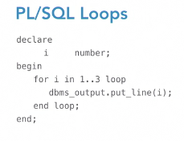

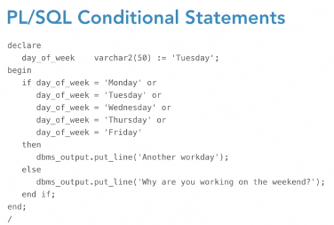

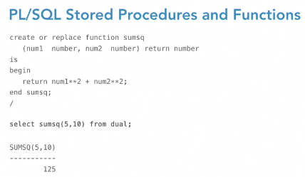

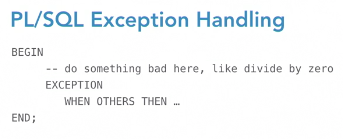

Remember:

- SQL: report writing needing simple joins, ad hoc queries
- PL/SQL
  - Complex business logic
  - Stored procedures or functions

## The ANSI SQL language standard

https://www.linkedin.com/learning/learning-oracle-database-19c/the-ansi-sql-language-standard?u=26110466

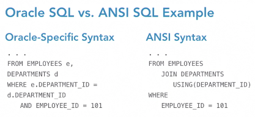

## Creating Functions

- Syntax for CREATE function

  - name the function
  - what will it return?

  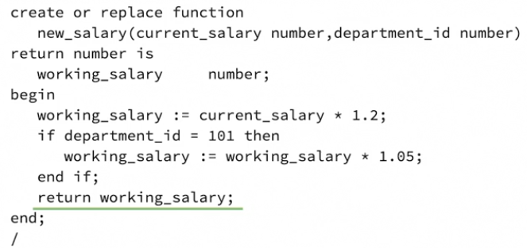

## Creating Procedures

- Encapsulated section of PL/SQL or Java code
- Can be anonymous
- Zero or more arguments, but don't return values
  - 
- Can be stored in a package with other stored functions, procedures, and types

## Declaring Variable

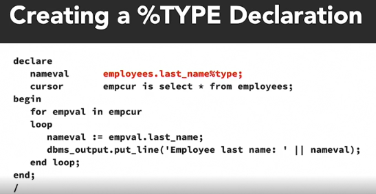

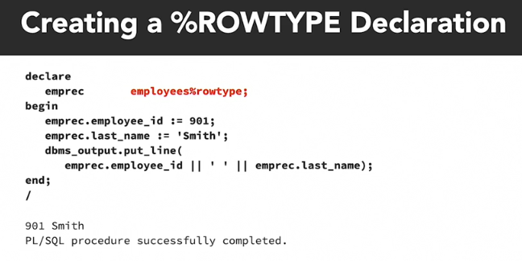

## Declare Cursor

### What is Cursor?

- a pointer to a private SQL are with metadata for running a SELECT or other DML statement
- two types: explicit and implicit

### Explicit Cursor

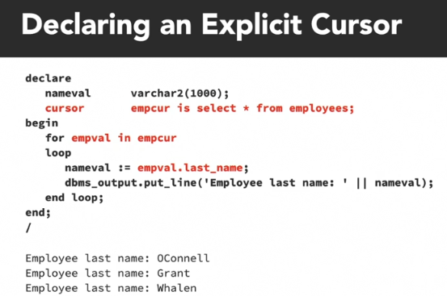

### Implicit Cursor

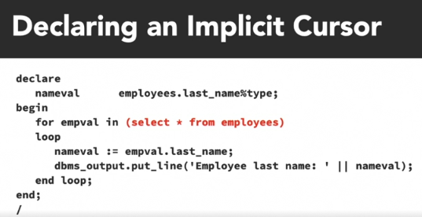

### Built-In  Cursor

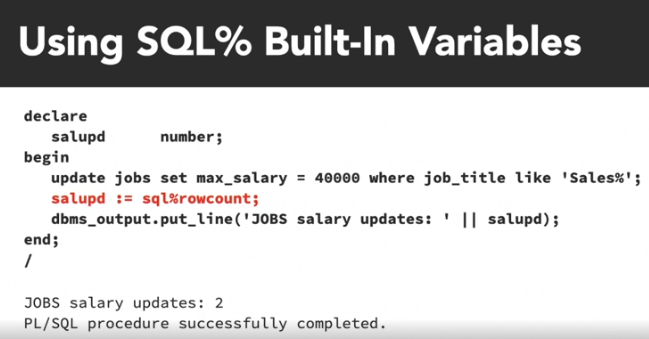

## Using SQL SELECT Statement

### Static SQL Statement

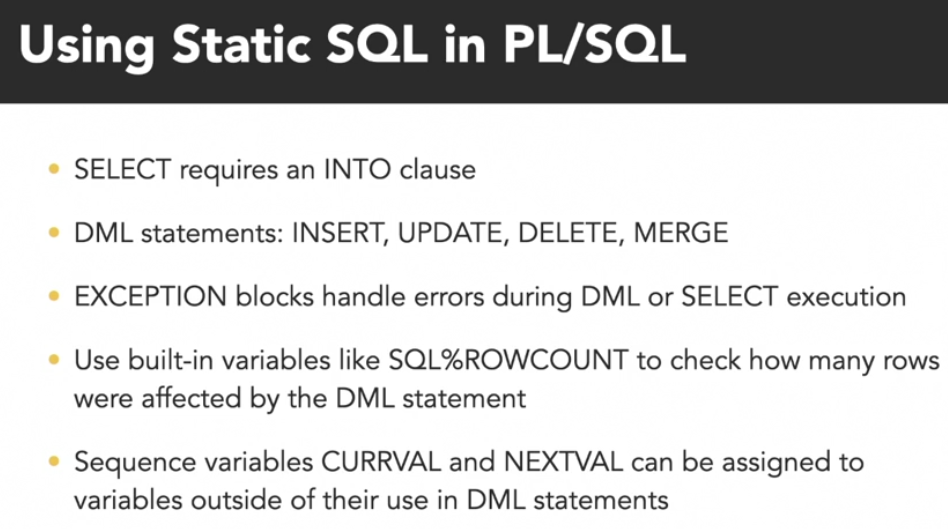

## Error Handling

