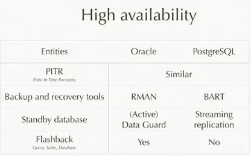
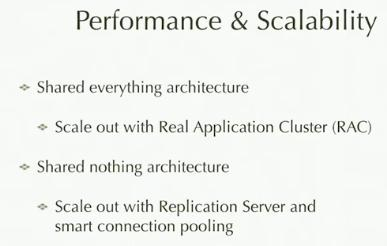
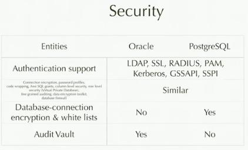
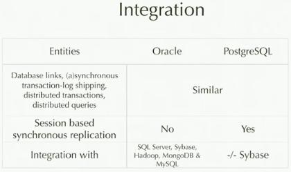
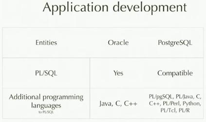
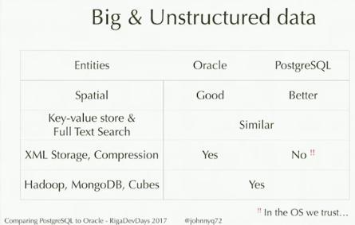
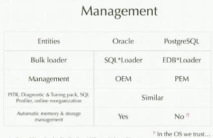
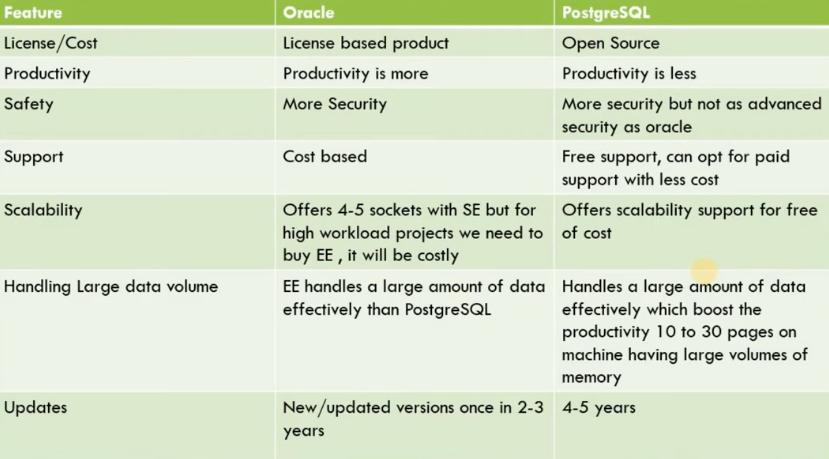

​            

[          ](https://www.youtube.com/)EE

  9+

  

​                    

[          ](https://www.youtube.com/)

[                  ](https://www.youtube.com/)

[                              ](https://www.youtube.com/)

[                  ](https://www.youtube.com/feed/explore)

[                              ](https://www.youtube.com/feed/explore)

[                  ](https://www.youtube.com/feed/subscriptions)

[                              ](https://www.youtube.com/feed/subscriptions)

  [                  ](https://www.youtube.com/feed/library)

[                              ](https://www.youtube.com/feed/library)

[                  ](https://www.youtube.com/feed/history)

[                              ](https://www.youtube.com/feed/history)

[                  ](https://studio.youtube.com/channel/UCPpPRMV9EjMy1EIM5G0OA0w/videos)

[                              ](https://studio.youtube.com/channel/UCPpPRMV9EjMy1EIM5G0OA0w/videos)

[                  ](https://www.youtube.com/playlist?list=WL)

[                              ](https://www.youtube.com/playlist?list=WL)

[                  ](https://www.youtube.com/playlist?list=LL)

[                              ](https://www.youtube.com/playlist?list=LL)

​              

​                      

###   

[                                      ](https://www.youtube.com/channel/UC7E-LYc1wivk33iyt5bR5zQ)

[          ](https://www.youtube.com/channel/UC7E-LYc1wivk33iyt5bR5zQ)

[                                      ](https://www.youtube.com/channel/UC5BMIWZe9isJXLZZWPWvBlg)

[          ](https://www.youtube.com/channel/UC5BMIWZe9isJXLZZWPWvBlg)

[                                      ](https://www.youtube.com/channel/UCSrZ3UV4jOidv8ppoVuvW9Q)

[          ](https://www.youtube.com/channel/UCSrZ3UV4jOidv8ppoVuvW9Q)

[                                      ](https://www.youtube.com/channel/UCVgO39Bk5sMo66-6o6Spn6Q)

[          ](https://www.youtube.com/channel/UCVgO39Bk5sMo66-6o6Spn6Q)

[                                      ](https://www.youtube.com/channel/UCV0qA-eDDICsRR9rPcnG7tw)

[          ](https://www.youtube.com/channel/UCV0qA-eDDICsRR9rPcnG7tw)

[                                      ](https://www.youtube.com/channel/UCLA_DiR1FfKNvjuUpBHmylQ)

[          ](https://www.youtube.com/channel/UCLA_DiR1FfKNvjuUpBHmylQ)

[                                      ](https://www.youtube.com/channel/UCzl0OrB3-ehunyotIQvK77A)

[          ](https://www.youtube.com/channel/UCzl0OrB3-ehunyotIQvK77A)

​              

​                      

###   

[                  ](https://www.youtube.com/premium)

[                              ](https://www.youtube.com/premium)

[                  ](https://www.youtube.com/gaming)

[                              ](https://www.youtube.com/gaming)

[                  ](https://www.youtube.com/channel/UC4R8DWoMoI7CAwX8_LjQHig)

[                              ](https://www.youtube.com/channel/UC4R8DWoMoI7CAwX8_LjQHig)

[                  ](https://www.youtube.com/channel/UCEgdi0XIXXZ-qJOFPf4JSKw)

[                              ](https://www.youtube.com/channel/UCEgdi0XIXXZ-qJOFPf4JSKw)

[                  ](https://www.youtube.com/account)

[                              ](https://www.youtube.com/account)

[                  ](https://www.youtube.com/reporthistory)

[                              ](https://www.youtube.com/reporthistory)

​              

​                      

​              

​                      

​      

​      

​            

​      

# Jan Karremans - Comparing PostgreSQL to Oracle. The best kept secrets to success

https://www.youtube.com/watch?v=NHUVJBrpF64

- Speaker: Jan Karremans, EDB Postgres
- Oracle = Oracle Enterprise Edition
- Postgres = Enterprise Postgres DB
- High Availability
  
- Performance and Scalability
  
- Security
  
- Integration
  
- Application Development
  
- Big and Unstructured Data
  
- Management
  

# Oracle Vs PostgreSQL [#Database](https://www.youtube.com/hashtag/database) [#Which](https://www.youtube.com/hashtag/which) is most [#Powerful](https://www.youtube.com/hashtag/powerful) database?

https://www.youtube.com/watch?v=Uo_jnAKLqAg

- Oracle
  - developed in 1977
  - Editions
    - Enterprise
    - Standard
    - Express
    - Oracle Lite
  - Run on the major platforms like Windows, UNIX, Linux, and macOS
  - It build around a relational database in which data can be accessed by users through an application or query language called SQL
- PostgreSQL
  - Support all features of RDBMS along with that other features which are not available in RDBMS such as views, stored procedures, indexes, and triggers
  - Has open database connectivity
  - Run on the major platforms
  - It support unstructured data such as video, text,a udio, images
  - API for different languages such as C/C++, Java, Python, Perl, etc
- Oracle vs PostgreSQL
  
- Conclusion
  - Postgres is more powerful than Oracle in many aspects
  - Compatibility with other RDBMS and ease use with large community of developers