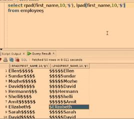
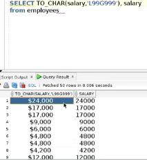
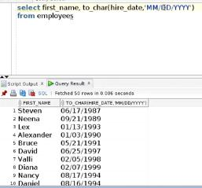
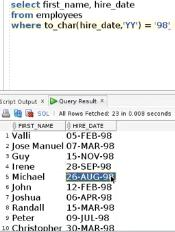
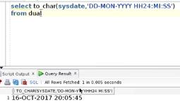
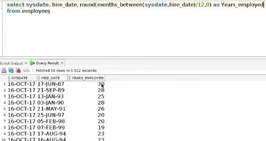
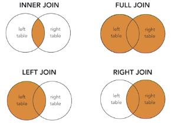
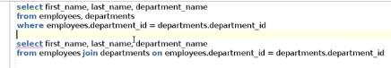

# Oracle SQL

## Unlocking user account

https://www.oracletutorial.com/oracle-administration/how-to-unlock-a-user-in-oracle/

## Dual

In Oracle 10g release 1 and above, Oracle treats the use of `DUAL` the same as calling a function which simply evaluates the expression  used in the select list. This optimization provides even better  performance than directly accessing the physical `DUAL` table

https://www.oracletutorial.com/oracle-basics/oracle-dual-table/.

## Manipulating Data

https://www.linkedin.com/learning/oracle-database-12c-basic-sql/introduction-to-transactions?u=26110466

Terms

- Transaction = every SQL command in Oracle, must be DML command
- Commit = submit the SQL command into Oracle DB, must be DML command
- Rollback = cancel the SQL command, so it will not be executed in the table, must be DML command
- Queries = retrieving data from database tables
- DDL = Data Definition Language, creating new database objects
  - CREATE
  - ALTER
  - DROP
  - TRUNCATE
- DML = Data Manipulation Language, modifying existing data in your database
  - SELECT
  - INSERT
  - UPDATE
  - DELETE

## Basic SQL clause

- String inside quotation mark 'E%'

  - case sensitive, means 'E%' and 'e%' are different
  - happened in LIKE, IN

- LIKE only for string values

- IN can be used for numeric values

  - also can use NOT IN

- `to_date()` function

  - for example:

    ```sql
    select * from employee
    where hire_date > to_date('01-JAN-2000', 'DD-MON-YYYY')
    ```

- Using `DISTINCT` to eliminate duplicates

  - Example:

    ```sql
    select distinct department_id, salary
    from employees
    ```

- Performing basic numeric calculation inside the SELECT is possible

- Describe the structure of a table using `DESCRIBE <table_name>`


## String, Number, and Date Functions

- LENGTH = get the length of the string value

- SUBSTR = get the character from string values

  - SUBSTR(<col_name>, starting_pos, length)

- CONCAT = combine multiple string values

  - alternative using ||

- LOWER  / UPPER = change the string value to lower/upper case

- INSTR = get the position of the first character inside string values

  - phone_number: 011.44.1344.345268
  - INSTR(phone_number, '5')
  - result = 15 (start with 1, dot(.) character counted)

- RPAD and LPAD = padding from right/left side of string values

  

- TO_CHAR

  - to convert number into a string and give it specific format
    
  - to format DATE values
    
  - to filter DATE values
    

- The Special Oracle DUAL table

  - created during the installation of Oracle DB
  - used to select any value without create/specifying database/table

- ROUND = round the number value into certain decimal points, with round up/down values

- TRUNC = truncate the number value from defined position, without rounding the values

- SYSDATE = displaying current date and time

  - combine with TO_CHAR
    

- SYSTIMESTAMP = get the current timestamp with highest precision

- MONTHS_BETWEEN = calculate how many months have been passed between two distinct dates

  - Example case: get the number of years employed
    

- ADD_MONTHS = add a specified number of months to specific date

  - Example case:

    ```sql
    add_months(sysdate, 2)
    ```


## Joining Table Data

- All types of join
  

- Oracle join syntax vs ANSI syntax
  
  - Oracle has different syntax that give same result
  - For compatiblity, it's recommended to use the ANSI syntax


