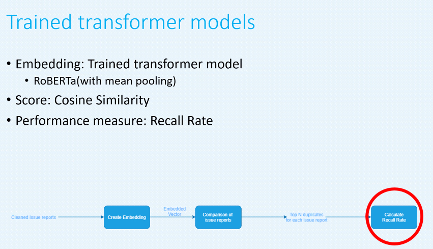
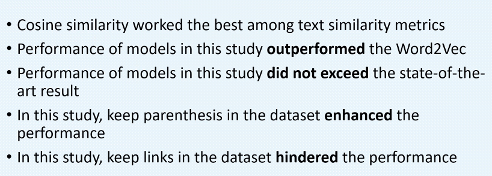

# Thesis - Issue Tracker NLP

01.06.2021

UT Th Def

https://comserv.cs.ut.ee/ati_thesis/datasheet.php?id=72285&year=2021

## Motivation and RQ

## Methodology

.png)

## Data Cleaning

## Data Pre-Processing

- Cleaning, removing some unnecessary parts, etc

## Baseline

- Cosine similarity
  

## Pre-trained transformer models

- PTM is the model that has been trained by someone else

## Trained Transformer Models

## Results

## Conclusion

## Q&A

### Determine the dimensions of embedding

### Determine the transformations

### Models in Real Life

## Photos

