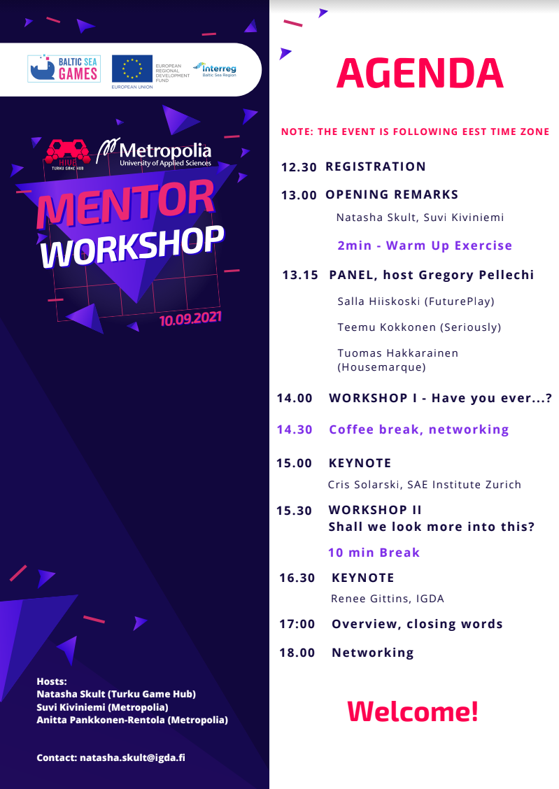
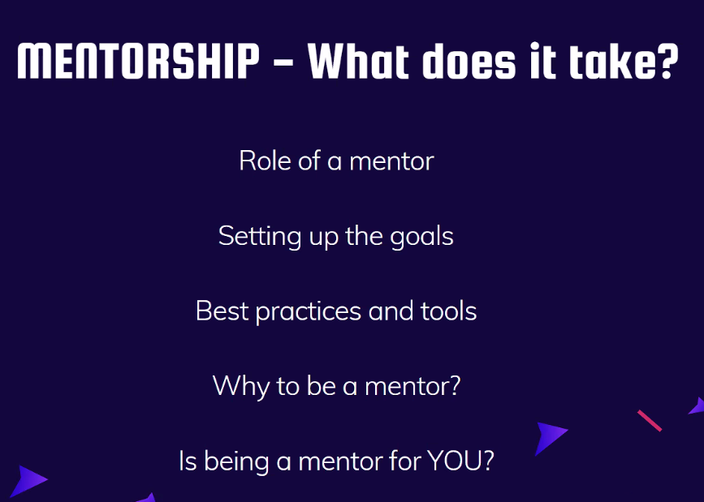
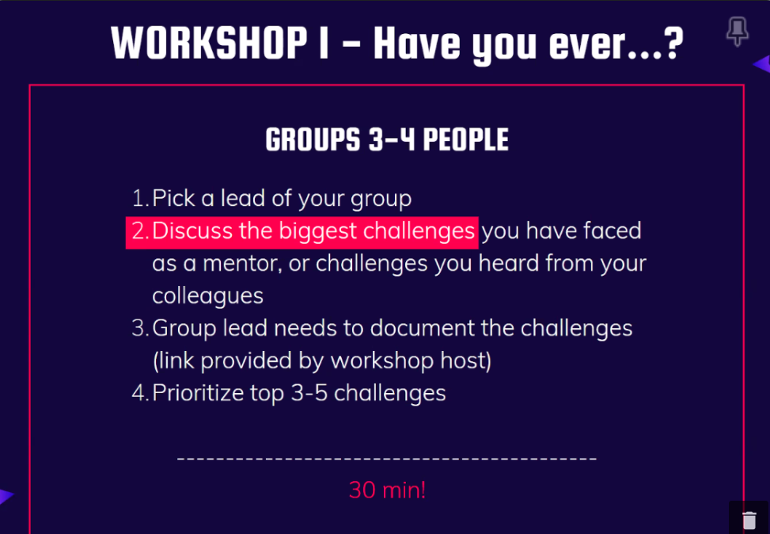
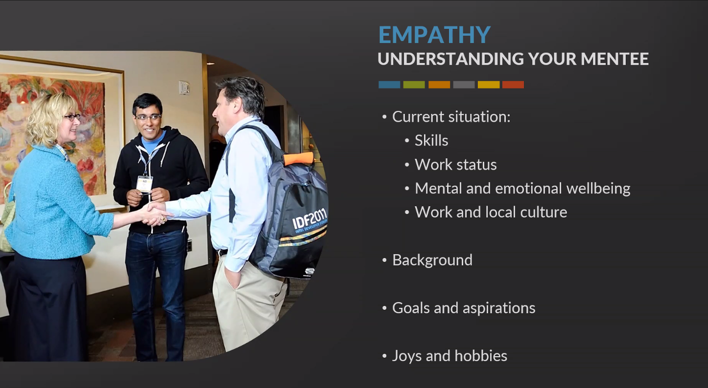
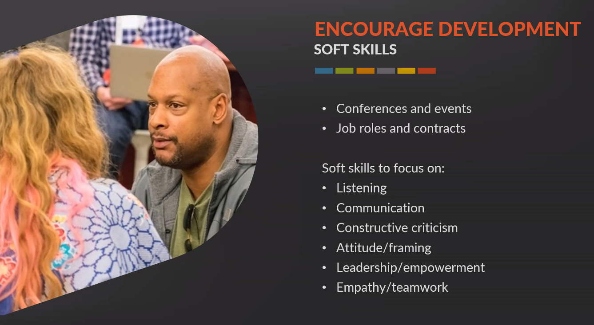
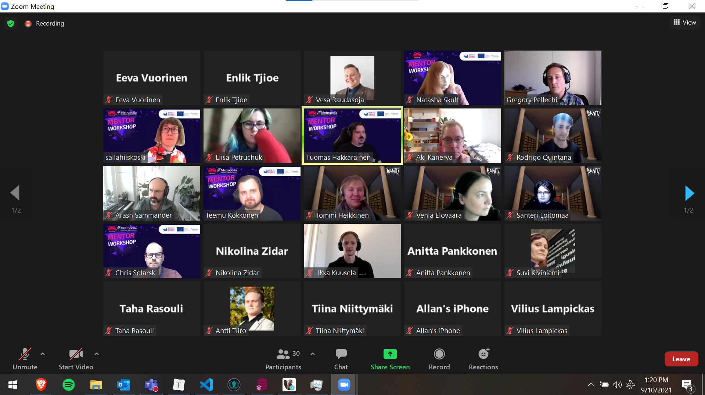
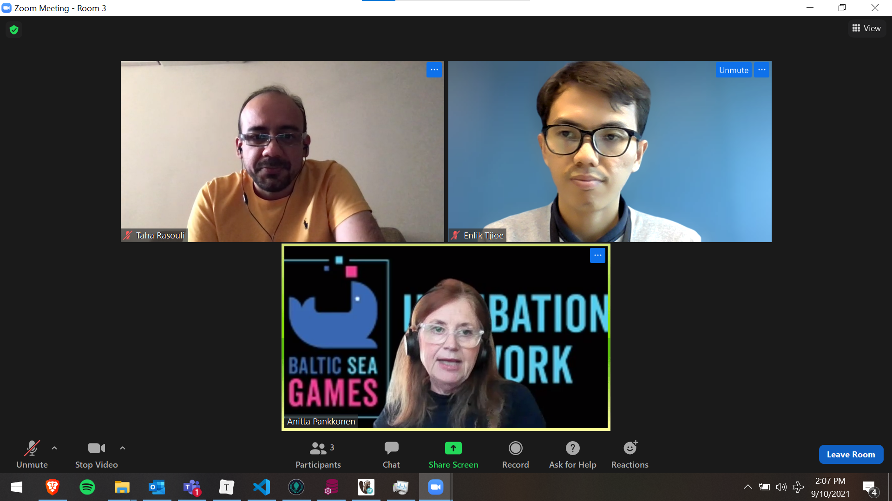

## Baltic Sea Game Industry (BSGI) - Mentor Workshop

10.09.2021

via Zoom

## Agenda

## Overview

Warm-up exercise - What is your expectation?

- To learn more about baltic game industry
- To learn become mentor

## Workshop 1

https://docs.google.com/presentation/d/1O6NnWH0-hlq1LjoRpGPP98GXRRPO6Bi7Z16R4JhNDFI/edit#slide=id.p

## Keynotes

By: Renee Gittins (IGDA)

## Pics

