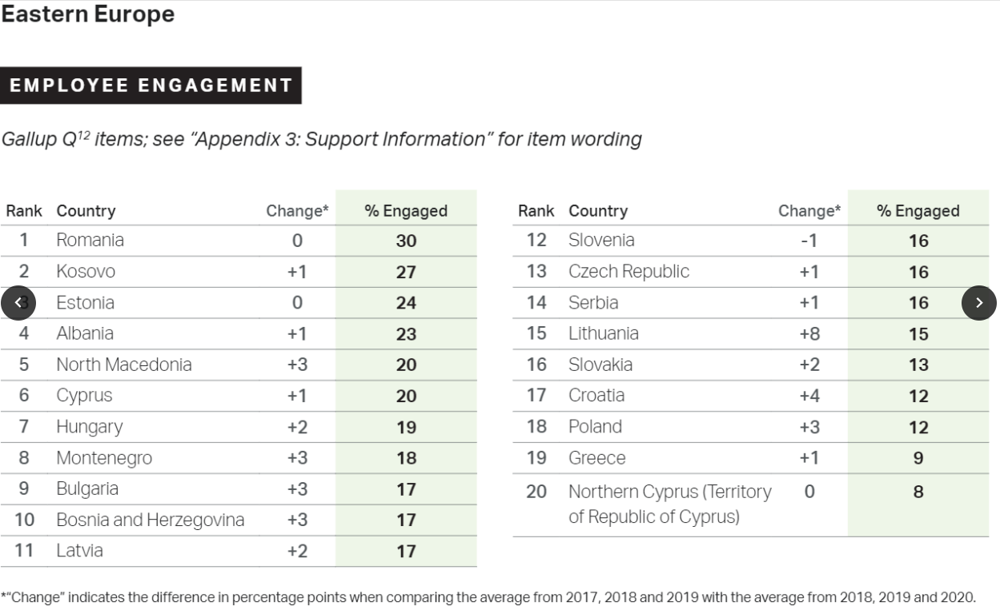

# Future Forum Conference

08-10 Sep 2021

Ulemiste City, Tallinn

https://www.futureforum.ee/

https://www.worksup.com/ucff

## *Panel: How to Make the Future Talents Shine?*

The global hunt for top talent is not news anymore. In this panel, we will dig deeper into what kind of environment will attract and thrive talents.

- Global competition – the winners and the losers?
- What kind of global talent is needed and hunted tomorrow?
- How to make the future talents shine?
- Is a data-driven and green business a magnet for global talents?
- What kind of environment attracts global talents?

Panellists:
[Karoli Hindriks](https://www.futureforum.ee/esineja/karoli-hindriks/), CEO, [Jobbatical](https://jobbatical.com/)
[Ivo Lasn](https://www.futureforum.ee/esineja/ivo-lasn/), CEO, [Playtech Estonia](https://playtech.ee/)
[Meelis Lang](https://futureforum.ee/esineja/panel-how-to-find-and-retain-future-talents/), CIO, [Helmes](https://www.helmes.com/)
[Leonardo Ortega](https://www.futureforum.ee/esineja/leonardo-ortega/), CEO, [International House of Estonia](https://workinestonia.com/internationalhouse/)
[Estel Pukk](https://www.futureforum.ee/esineja/estel-pukk/), HR Partner, [Eurora](https://eurora.com/)
[Lauri Haav](https://www.futureforum.ee/esineja/lauri-haav/), CEO, [e-Residency](https://e-resident.gov.ee/)

Moderator:
[Kristjan Lepik](https://futureforum.ee/esineja/kristjan-lepik/), Supervisory Board Member, [Praxis](https://www.topia.com/)

### Personal notes

- We can’t compare to the past, because the world is changing
  - Case: I’m running in the forest, but my 8-years old boy running in Minecraft game
  - We’re moving from typewriter into desktop/laptop writer
  - Germany need 400k+ talents
  - Create an environment that people can grow
  - The pandemic leads to people who like the flexibility of workspace
  - Collaboration between different EU countries, to attract talent, knowledge sharing

## *Panel: Health Hacks, Tools & Models—How to Thrive Your Talents?*

The panel will focus on the importance of the health of talents and the innovative solutions that help with that.

- How can we build a healthy business campus in partnership with talents and employers?
- Which are the innovative development management models at the level of the employee, the employer, the campus or the city?
- How does data contribute to employee satisfaction and work efficiency? 
- How can you develop a health brand for your business, city or campus?

Panellists:
[Andero Uusberg](https://www.futureforum.ee/esineja/andero-uusberg/), Psychologist and a researcher, [University of Tartu](https://www.ut.ee/en)
[Kerli Reinholm](https://futureforum.ee/esineja/panel-health-hacks-tools-and-modelshow-to-thrive-your-talents/), CMO, [Bikeep](https://bikeep.com/et/)
[Antti Miettinen](https://www.futureforum.ee/esineja/antti-miettinen/), Director of Working Life Services, [Mehiläinen](https://www.mehilainen.fi/en)
[Erki Mölder](https://futureforum.ee/esineja/erki-molder/), Co-Founder, [Health Founders](https://healthfounders.ee/)
[Miriam Weber](https://www.futureforum.ee/esineja/panel-health-hacks-tools-and-modelshow-to-thrive-your-talents-2/), Healthy City Coordinator, [Municipality of Utrecht](https://www.utrecht.nl/city-of-utrecht/)
[Helena Viiroja](https://futureforum.ee/esineja/panel-health-hacks-tools-and-modelshow-to-thrive-your-talents-3/), Customer Service Guru, [Tele2](https://tele2.ee/)

Moderator:
[Helen Sooväli-Sepping](https://www.futureforum.ee/esineja/helen-soovali-sepping/), Head of Natural Sciences and Sustainability, [Tallinn University](https://www.tlu.ee/en)

### Personal Notes

- Being lazy is ok, we can't force people
- Maintaining health
  - The importance of sleep and walk for your health
  - Survey: 20% of cyclist
  - Cycling is about connecting all of your senses

# Hack4Future Notes

## Key Questions - Bolo startup

- Mix Matching based on same interests or preference
- Meet stranger in the office
- VideoCall or doing an activity with your co-worker that you've never met before

Tackle challenges in remote work:
\- Informal communication
\- Employee satisfaction

Key points from problem validation:
\- 

Key Points from
https://www.quantumworkplace.com/future-of-work/remote-work-statistics

### 5 Key Strategies for Attracting and Retaining Top Talent (page 41)

\1. Connect employees to meaningful mission and purpose (make employees be part of something larger than themselves, something meaningful)
According to our 2019 Best Places to Work data, more than 8 in 10 employees agree they are inspired by the work that the do at their organization.
USAA (US company) also reiterates its mission and purpose in town hall meetings and other forums where employees share ideas about how to fulfill this commitment
https://hbr.org/2018/07/creating-a-purpose-driven-organization

\2. Value and recognize employees for their contributions
According to our 2019 Best Places to Work data, when employees are confident they will be recognized for contributing to organizational success, they are 2.7x more likely to be highly engaged (88%) than those who are not (33%)
Example:
\> Google Kudos - a peer-to-peer recognition program that lets employees send online thank-you notes to coworkers without going through an approval process
https://bucketlistrewards.com/blog/best-places-to-work-on-earth-tips-to-reward-and-recognize-your-employees-like-google/
https://www.slideshare.net/AmrSherif4/google-rewarding-programmes 
(page 10)

https://www.kudos.com/
Kudos https://www.youtube.com/watch?v=hin-kSI_vBw

Teams plugin - Recognize https://www.youtube.com/watch?v=iQImlMQ7iIo

How Do I Build a Successful Employee Recognition Program?
https://www.youtube.com/watch?v=bRM19CxIDek
Kudos alternatives: https://snacknation.com/blog/employee-recognition-software/

> Disney #CastCompliment program (pic attached)

\3. Invest in employee growth and development
According to our 2019 Best Places to Work data, when employees see professional growth and career development opportunities in their organization, they are 2.5x more likely to be highly engaged (89%) than those who do not (36%)
Example:
\> Giving access to online course platform such as LinkedIn Learning, Udemy, Coursera, etc

\4. Prioritize team dynamics and support
According to our 2019 Best Places to Work data, when employees feel that the people they work with treat each other with respect, they are 4x more likely to be highly engaged (82%) than those who do not (21%)

\5. Support employee health and wellness.
According to our 2019 Best Places to Work data, when employees believe their workplace supports their health & wellbeing, they are 3.5x more likely to be highly engaged (84%) than those who do not (24%).

Example:
Software company Asana offers unique benefits like wellness classes and coaching, on-site culinary teams, and even rooms to nap and rest during the day. They have a focus on managing burnout, removing distraction from the workplace, and improving work-life balance.
https://www.monster.com/career-advice/article/companies-good-wellness-programs

https://www.gallup.com/workplace/349484/state-of-the-global-workplace.aspx?thank-you-report-form=1

### State of the Global Workspace

Eastern Europe
Employee engagement (pic attached) -> top 3 Romania, Kosovo, Estonia

## General Notes

### Idea

blockchain for something
game for environmental awareness (inspired by Alba: A Wildlife Adventure)
Foodsharing platform 

Kitchen for hire (a startup that rents commercial space and turns it into shared kitchens for restaurateurs in late 2019.
https://www.businessinsider.com/cloud-kitchens-travis-kalanick-san-francisco-location-address-pictures-2019-11
https://www.cloudkitchens.com/

AI forecast for food
[Savvie.io](http://savvie.io/)

Ethereum blockchain
Airbnb for goods
https://devpost.com/software/airbnb-for-household-items

### Keynotes:

Skeleton technologies:
\- first electric car, 150 years ago
\- the challenge: which business model to go after with electrification of vehicle? 
\- ultracapacitors as better batteries, with many reasons
\- better = lower cost against customer requirements
\- example in tram, kinetic energy recuperation system, 98.8% energy saved for acceleration
\- active suspension, usecase in German automotive OEM
\- engine starting, usecase in European truck OEM
\- not compete with Li-ion and Hydrogen fuel, but complementing them
\- electrification is a dot on large map: big data, autonomy, shared mobility, urbanization, ML, renewable energy, etc
\- when talk about battery, it's very related to laptop and cellphone, but not so many think about vehicle yet
\- Skeleton technology was founded in 2009
\- Ultra capacitors is a niche-market industry worth c.a 100M industry
\- taking chance in fast moving industry, for example: Skeleton provides the material for Bolt ridesharing vehicle. It helps integrating it
\- Estonia a place to find more unicorns
\- future digital trends: chances and challenges 
 \- new work
 \- cloud based solution
 \- quantum computing 
 \- connected system
\- future green trends:
 \- minimalism 
 \- direct trade
 \- urban farming
\- for next unicorn
 \- you need more than an idea, you need a vision
 \- provide tangible solution
 \- key enabler in the field
 \- know what tech does well, and what it doesn't
 \- take a holistic point of view and looks further ahead than the rest, as we're moving faster and further

### Company pitching

Helmes
Silvia Tali, Helmes
[silvia.tali@helmes.com](mailto:silvia.tali@helmes.com)
\- how to support collaboration and engagement in hybrid team?
 \- virtual engagement room in 2D world 
 \- bi-weekly sharing
 \- build a channel for sharing non-work topic, like well being matters
\- helmes is international custom software development company, 1k+ customers
\- challenges:
 \- collaboration is more difficult with remote work 
 \- engagement decreases over time
 \- 30% employees will leave if employed forced work on-site policy
\- points:
 \- efficiency, collaboration and engagement, wellbeing, office costs, new tools, practices, office, unknown future

XFly
Aviation needs more female pilots
Moonika Oras
Internal Communication and Employee Well-Being Specialist
\- 400+ people, HQ in Ulemiste city, 🇪🇪 
\- problem: only 5% of pilots globally are female, and tiny 1.42% of all captains are female (gender inequality), global shortage of pilots: average cost to become pilot around 100k EUR
\- idea:
 \- more scholarship for women interested in Aviation
 \- podcast program about aviation with female guests or hosts
\- XFly only has 6% of female pilots
\- India 20% female, Ireland, and South Africa (top 3)
\- key questions:
 \- how to attract new female pilots and keep them in a company?

TVO
Gaili Eding
Head of Marketing and Communication
Challenge: people have to start sorting waste
\- In Estonia, it's mandatory to sort waste since 2007
\- no significant development in last 10 years
\- only third of waste is reused
\- we must recycle 55% of municipal waste by 2025 and 60% by 2030
\- key note: help us to hack into people habits to sort waste
\- idea:
 \- start small
 \- make it obvious
 \- habit hacking, inspired by atomic habits

Health Founders
Siim Saare
How to extend human healthspan in a future city?
\- helping people to prevent disease using technology
\- healthspan = the amount of time for person being health
\- 41M people died because of diseases
\- 41T amount of money spent in healthcare budget
\- 3% percentage of budget to prevent chronical disease, 97% go to normal medical
\- Determinants of Overall Health
 \- 40% lifestyle / individual behavior
 \- 30% genetics
 \- 15% social circumstance
 \- 10% healthcare
 \- 5% environmental factor
\- key note: how we can use smart city infrastructure and techs to extend human healthspan?
 \- Ulemisty city as a prototype
\- Ideas:
 \- strava for smartcity, challenge people to work out, make leaderboard, and give incentives
\- medicine delivery in collaboration with ride hailing
\- in-app consultation with the real doctor in desired language

### Resources

\1. The Mom's Test
\2. Thanks for the feedback
\3. Research crunchbase

