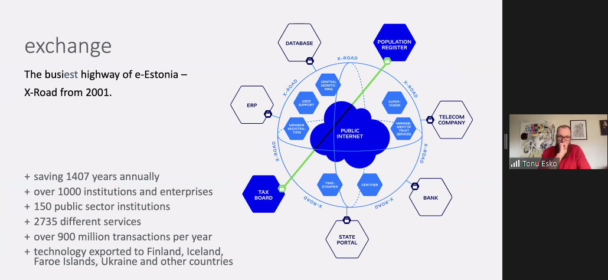
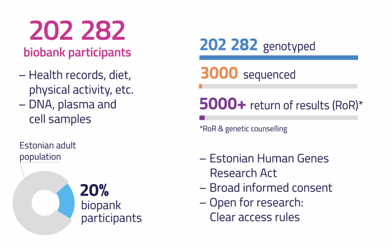
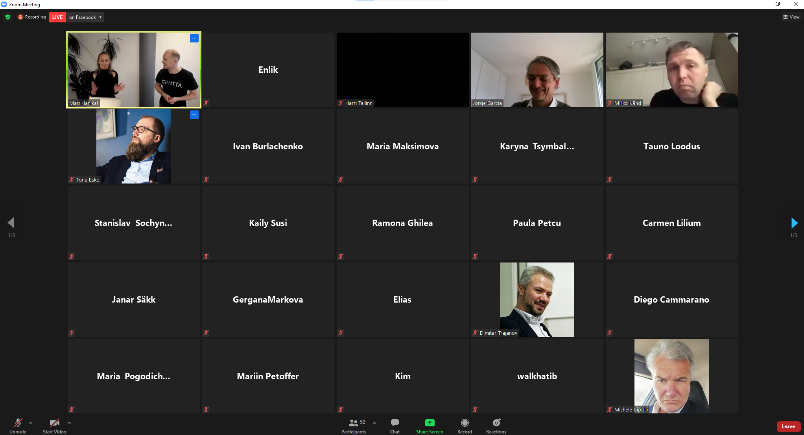

# Intro Session to #Data4EU Recovery Hackathon

23 April 2021

via Zoom

## **Agenda of the event**

16:00 Opening by the moderators. A brief introduction to the programme, its goals,  timeline and deadlines, next steps!
16:10 Tõnu Esko introducing Estonian Biobank and the challenge they bring- "Personalised Predictive Medicine". Q&A time.
16:40  Jorge García Galduroz introducing MyVitale and the challenge they bring - "Data extraction and centralization for better decision making."  Q&A time.
17:10 How does idea submission look like?
17:20-17:50 We break the challenge partners into two separate Zoom rooms. You are  most welcomed to visit them and get an answer to whatever burning  questions you might still have!

## Intro to Estonian Bio Databank

By: Tonu Esko

## Photos

